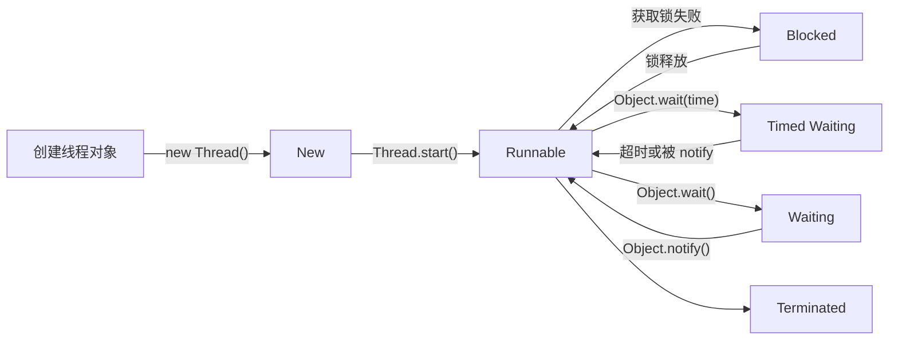

# 线程基础
## 线程状态


### 线程状态说明
#### **New**
线程对象被创建，但尚未启动。
> 通过 `new Thread()` 创建线程对象时，线程处于 New 状态。

#### **Runnable**
线程正在运行或准备运行。
> 调用 `Thread.start()` 方法后，线程进入 Runnable 状态，等待 CPU 调度执行。
> 其他线程`notify()`
> `Timed Waiting` 时间结束后。

#### **Blocked**
线程被阻塞，等待获取锁。
> 当一个线程试图获取一个被其他线程持有的锁时，它会进入 Blocked 状态，直到锁被释放。

#### **Watting**
等待其它线程显式地唤醒，否则不会被分配 CPU 时间片。

进入方法|退出方法
-|-
没有设置 Timeout 参数的 `Object.wait()` 方法|`Object.notify()` / `Object.notifyAll()`
没有设置 Timeout 参数的 `Thread.join()` 方法|被调用的线程执行完毕
`LockSupport.park()`方法|-

> LockSupport.park()：阻塞当前线程，直到发生以下情况之一 `其他线程调用了LockSupport.unpark(当前线程)`和`当前线程被中断（Thread.interrupt()`或者`发生“无原因返回”（也就是可能在没有明确原因的情况下返回，所以用法上通常要配合条件判断循环）`


> park()不承诺一定是“永久停住”，所以正确姿势一般是：“条件不满足就继续停”，用while循环反复检查条件


```java
import java.util.concurrent.locks.LockSupport;

public class LockSupportExample {

    public static void main(String[] args) throws Exception {
        Thread worker = new Thread(() -> {
            System.out.println("工作线程：准备暂停");
            LockSupport.park(); // 暂停，等待许可或中断
            System.out.println("工作线程：被唤醒后继续执行");
        });

        worker.start();

        Thread.sleep(300);

        System.out.println("主线程：发放许可，唤醒工作线程");
        LockSupport.unpark(worker);

        worker.join();
    }
}

```

#### **Timed Waiting**

进入方法|退出方法
-|-
`Thread.sleep()` 方法	| 时间结束
设置 Timeout 参数的 `Object.wait()` 方法|时间结束 / `Object.notify()` / `Object.notifyAll()`
设置 Timeout 参数的 `Thread.join()` 方法|时间结束 / 被调用的线程执行完毕
`LockSupport.parkNanos()` 方法	|
`LockSupport.park()`方法|-

> LockSupport.parkNanos(纳秒数); 含义：最多阻塞当前线程这么长时间（纳秒级别的时间参数），但也可能因为以下原因提前返回：
> 被unpark唤醒/被中断/时间到了（超时返回）/无原因返回

#### **Terminated**
可以是线程结束任务之后自己结束，或者产生了异常而结束。

## 线程使用
有三种使用线程的方法:
- 实现 Runnable 接口；
- 实现 Callable 接口；
- 继承 Thread 类。

### 实现 Runnable 接口
需要实现 run() 方法。

通过 Thread 调用 start() 方法来启动线程。
```java
public class MyRunnable implements Runnable {
    public void run() {
        // ...
    }
}
```
```java
public static void main(String[] args) {
    MyRunnable instance = new MyRunnable();
    Thread thread = new Thread(instance);
    thread.start();
}
```

### 实现 Callable 接口
> 与 Runnable 相比，Callable 可以有返回值，返回值通过 FutureTask 进行封装。

```java
public class MyCallable implements Callable<Integer> {
    public Integer call() {
        return 123;
    }
}
```
```java
public static void main(String[] args) throws ExecutionException, InterruptedException {
    MyCallable mc = new MyCallable();
    FutureTask<Integer> ft = new FutureTask<>(mc);
    Thread thread = new Thread(ft);
    thread.start();
    System.out.println(ft.get());
}
```
### 继承 Thread 类
同样也是需要实现 run() 方法，因为 Thread 类也实现了 Runable 接口。

当调用 start() 方法启动一个线程时，虚拟机会将该线程放入就绪队列中等待被调度，当一个线程被调度时会执行该线程的 run() 方法。
```java
public class MyThread extends Thread {
    public void run() {
        // ...
    }
}
```
```java
public static void main(String[] args) {
    MyThread mt = new MyThread();
    mt.start();
}
```

### 实现接口 VS 继承 Thread
实现接口会更好一些，因为:
- Java 不支持多重继承，因此继承了 Thread 类就无法继承其它类，但是可以实现多个接口；
- 类可能只要求可执行就行，继承整个 Thread 类开销过大。


## 基础线程机制
### Executor
Executor 管理多个异步任务的执行，而无需程序员显式地管理线程的生命周期。这里的异步是指多个任务的执行互不干扰，不需要进行同步操作。

主要有三种 Executor:

- CachedThreadPool: 一个任务创建一个线程；
- FixedThreadPool: 所有任务只能使用固定大小的线程；
- SingleThreadExecutor: 相当于大小为 1 的 FixedThreadPool。

```java
public static void main(String[] args) {
    ExecutorService executorService = Executors.newCachedThreadPool();
    for (int i = 0; i < 5; i++) {
        executorService.execute(new MyRunnable());
    }
    executorService.shutdown();
}
```

> 一般不适用默认提供的线程池，因为现实情况复杂，默认线程池无法满足实际的环境，且`CachedThreadPool`可能导致无限线程，而`FixedThreadPool`和`SingleThreadExecutor`使用`LinkedBlockingQueue`无界的队列，容易造成oom

### Daemon
守护线程是程序运行时在后台提供服务的线程，不属于程序中不可或缺的部分。

当所有非守护线程结束时，程序也就终止，同时会杀死所有守护线程。

main() 属于非守护线程。

使用 setDaemon() 方法将一个线程设置为守护线程。

```java
public static void main(String[] args) {
    Thread thread = new Thread(new MyRunnable());
    thread.setDaemon(true);
}
```

### sleep()
Thread.sleep(millisec) 方法会休眠当前正在执行的线程，millisec 单位为毫秒。

sleep() 可能会抛出 InterruptedException，因为**异常不能跨线程传播**回 main() 中，因此必须在本地进行处理。线程中抛出的其它异常也同样需要在本地进行处理。

```java
public void run() {
    try {
        Thread.sleep(3000);
    } catch (InterruptedException e) {
        e.printStackTrace();
    }
}
```
### yield()
对静态方法 Thread.yield() 的调用声明了当前线程已经完成了生命周期中最重要的部分，可以切换给其它线程来执行。
该方法只是对线程调度器的一个建议，而且也只是建议**具有相同优先级的其它线程**可以运行。
## 线程中断
通过调用一个线程的 interrupt() 来中断该线程，如果该线程处于阻塞、限期等待或者无限期等待状态，那么就会抛出 InterruptedException，从而提前结束该线程。但是不能中断 I/O 阻塞和 synchronized 锁阻塞。
### InterruptedException
对于以下代码，在 main() 中启动一个线程之后再中断它，由于线程中调用了 Thread.sleep() 方法，因此会抛出一个 InterruptedException，从而提前结束线程，不执行之后的语句。

```java
public class InterruptExample {

    private static class MyThread1 extends Thread {
        @Override
        public void run() {
            try {
                Thread.sleep(2000);
                System.out.println("Thread run");
            } catch (InterruptedException e) {
                e.printStackTrace();
            }
        }
    }
}
```
```java
public static void main(String[] args) throws InterruptedException {
    Thread thread1 = new MyThread1();
    thread1.start();
    thread1.interrupt();
    System.out.println("Main run");
}
```
```java
Main run
java.lang.InterruptedException: sleep interrupted
    at java.lang.Thread.sleep(Native Method)
    at InterruptExample.lambda$main$0(InterruptExample.java:5)
    at InterruptExample$$Lambda$1/713338599.run(Unknown Source)
    at java.lang.Thread.run(Thread.java:745)
```
### interrupted()
如果一个线程的 run() 方法执行一个无限循环，并且没有执行 sleep() 等会抛出 InterruptedException 的操作，那么调用线程的 interrupt() 方法就无法使线程提前结束。

但是调用 interrupt() 方法会设置线程的中断标记，此时调用 interrupted() 方法会返回 true。因此可以在循环体中使用 interrupted() 方法来判断线程是否处于中断状态，从而提前结束线程。

```java
public class InterruptExample {

    private static class MyThread2 extends Thread {
        @Override
        public void run() {
            while (!interrupted()) {
                // ..
            }
            System.out.println("Thread end");
        }
    }
}
```
```java
public static void main(String[] args) throws InterruptedException {
    Thread thread2 = new MyThread2();
    thread2.start();
    thread2.interrupt();
}
```
```txt
Thread end
```

### Executor 的中断操作
调用 Executor 的 shutdown() 方法会等待线程都执行完毕之后再关闭，但是如果调用的是 shutdownNow() 方法，则相当于调用每个线程的 interrupt() 方法。

以下使用 Lambda 创建线程，相当于创建了一个匿名内部线程。

```java
public static void main(String[] args) {
    ExecutorService executorService = Executors.newCachedThreadPool();
    executorService.execute(() -> {
        try {
            Thread.sleep(2000);
            System.out.println("Thread run");
        } catch (InterruptedException e) {
            e.printStackTrace();
        }
    });
    executorService.shutdownNow();
    System.out.println("Main run");
}
```
```java
Main run
java.lang.InterruptedException: sleep interrupted
    at java.lang.Thread.sleep(Native Method)
    at ExecutorInterruptExample.lambda$main$0(ExecutorInterruptExample.java:9)
    at ExecutorInterruptExample$$Lambda$1/1160460865.run(Unknown Source)
    at java.util.concurrent.ThreadPoolExecutor.runWorker(ThreadPoolExecutor.java:1142)
    at java.util.concurrent.ThreadPoolExecutor$Worker.run(ThreadPoolExecutor.java:617)
    at java.lang.Thread.run(Thread.java:745)
```
如果只想中断 Executor 中的一个线程，可以通过使用 submit() 方法来提交一个线程，它会返回一个 Future<?> 对象，通过调用该对象的 cancel(true) 方法就可以中断线程。

```java
Future<?> future = executorService.submit(() -> {
    // ..
});
future.cancel(true);
```

## 线程互斥同步

Java 提供了两种锁机制来控制多个线程对共享资源的互斥访问，第一个是 JVM 实现的 `synchronized`，而另一个是 JDK 实现的 `ReentrantLock`。
### synchronized
#### 1. 同步一个代码块
```java
public void func() {
    synchronized (this) {
        // ...
    }
}
```
它只作用于**同一个对象**，如果调用两个对象上的同步代码块，就不会进行同步。

对于以下代码，使用 ExecutorService 执行了两个线程，由于调用的是同一个对象的同步代码块，因此这两个线程会进行同步，当一个线程进入同步语句块时，另一个线程就必须等待。
```java
public class SynchronizedExample {

    public void func1() {
        synchronized (this) {
            for (int i = 0; i < 10; i++) {
                System.out.print(i + " ");
            }
        }
    }
}
public static void main(String[] args) {
    SynchronizedExample e1 = new SynchronizedExample();
    ExecutorService executorService = Executors.newCachedThreadPool();
    executorService.execute(() -> e1.func1());
    executorService.execute(() -> e1.func1());
}
```
对于以下代码，两个线程调用了不同对象的同步代码块，因此这两个线程就不需要同步。从输出结果可以看出，两个线程交叉执行。

```java
public static void main(String[] args) {
    SynchronizedExample e1 = new SynchronizedExample();
    SynchronizedExample e2 = new SynchronizedExample();
    ExecutorService executorService = Executors.newCachedThreadPool();
    executorService.execute(() -> e1.func1());
    executorService.execute(() -> e2.func1());
}
```


#### 2. 同步一个方法
```java
public synchronized void func () {
    // ...
}
```

它和同步代码块一样，作用于同一个对象。


#### 3. 同步一个类
```java
public void func() {
    synchronized (SynchronizedExample.class) {
        // ...
    }
}
```
作用于整个类，也就是说两个线程调用同一个类的不同对象上的这种同步语句，也会进行同步。
```java
public class SynchronizedExample {

    public void func2() {
        synchronized (SynchronizedExample.class) {
            for (int i = 0; i < 10; i++) {
                System.out.print(i + " ");
            }
        }
    }
}
public static void main(String[] args) {
    SynchronizedExample e1 = new SynchronizedExample();
    SynchronizedExample e2 = new SynchronizedExample();
    ExecutorService executorService = Executors.newCachedThreadPool();
    executorService.execute(() -> e1.func2());
    executorService.execute(() -> e2.func2());
}
```
#### 4. 同步一个静态方法
```java
public synchronized static void fun() {
    // ...
}
```

作用于整个类。
### ReentrantLock

ReentrantLock 是 java.util.concurrent(J.U.C)包中的锁。

### 比较
#### 1. 锁的实现

synchronized 是 JVM 实现的，而 ReentrantLock 是 JDK 实现的。

#### 2. 性能

新版本 Java 对 synchronized 进行了很多优化，例如自旋锁等，synchronized 与 ReentrantLock 大致相同。

#### 3. 等待可中断

当持有锁的线程长期不释放锁的时候，正在等待的线程可以选择放弃等待，改为处理其他事情。

ReentrantLock 可中断，而 synchronized 不行。

#### 4. 公平锁

公平锁是指多个线程在等待同一个锁时，必须按照申请锁的时间顺序来依次获得锁。

synchronized 中的锁是非公平的，ReentrantLock 默认情况下也是非公平的，但是也可以是公平的。

#### 5. 锁绑定多个条件

一个 ReentrantLock 可以同时绑定多个 Condition 对象。

### 使用选择
除非需要使用 ReentrantLock 的高级功能，否则优先使用 synchronized。这是因为 synchronized 是 JVM 实现的一种锁机制，JVM 原生地支持它，而 ReentrantLock 不是所有的 JDK 版本都支持。并且使用 synchronized 不用担心没有释放锁而导致死锁问题，因为 JVM 会确保锁的释放。


## 线程之间的协作
当多个线程可以一起工作去解决某个问题时，如果某些部分必须在其它部分之前完成，那么就需要对线程进行协调。

### join
在线程中调用另一个线程的 join() 方法，会将当前线程挂起，而不是忙等待，直到目标线程结束。

对于以下代码，虽然 b 线程先启动，但是因为在 b 线程中调用了 a 线程的 join() 方法，b 线程会等待 a 线程结束才继续执行，因此最后能够保证 a 线程的输出先于 b 线程的输出。
```java
public class JoinExample {

    private class A extends Thread {
        @Override
        public void run() {
            System.out.println("A");
        }
    }

    private class B extends Thread {

        private A a;

        B(A a) {
            this.a = a;
        }

        @Override
        public void run() {
            try {
                a.join();
            } catch (InterruptedException e) {
                e.printStackTrace();
            }
            System.out.println("B");
        }
    }

    public void test() {
        A a = new A();
        B b = new B(a);
        b.start();
        a.start();
    }
}
```
```java
public static void main(String[] args) {
    JoinExample example = new JoinExample();
    example.test();
}
```
```
A
B
```

### wait() notify() notifyAll()
调用 wait() 使得线程等待某个条件满足，线程在等待时会被挂起，当其他线程的运行使得这个条件满足时，其它线程会调用 notify() 或者 notifyAll() 来唤醒挂起的线程。

它们都属于 Object 的一部分，而不属于 Thread。

只能用在同步方法或者同步控制块中使用，否则会在运行时抛出 IllegalMonitorStateExeception。

使用 wait() 挂起期间，线程会释放锁。这是因为，如果没有释放锁，那么其它线程就无法进入对象的同步方法或者同步控制块中，那么就无法执行 notify() 或者 notifyAll() 来唤醒挂起的线程，造成死锁。

```java
public class WaitNotifyExample {
    public synchronized void before() {
        System.out.println("before");
        notifyAll();
    }

    public synchronized void after() {
        try {
            wait();
        } catch (InterruptedException e) {
            e.printStackTrace();
        }
        System.out.println("after");
    }
}
```
```java
public static void main(String[] args) {
    ExecutorService executorService = Executors.newCachedThreadPool();
    WaitNotifyExample example = new WaitNotifyExample();
    executorService.execute(() -> example.after());
    executorService.execute(() -> example.before());
}
```
```
before
after
```

#### wait() 和 sleep() 的区别
- wait() 是 Object 的方法，而 sleep() 是 Thread 的静态方法；
- wait() 会释放锁，sleep() 不会。

### await() signal() signalAll()
java.util.concurrent 类库中提供了 Condition 类来实现线程之间的协调，可以在 Condition 上调用 await() 方法使线程等待，其它线程调用 signal() 或 signalAll() 方法唤醒等待的线程。相比于 wait() 这种等待方式，await() 可以指定等待的条件，因此更加灵活。

使用 Lock 来获取一个 Condition 对象。

```java
public class AwaitSignalExample {
    private Lock lock = new ReentrantLock();
    private Condition condition = lock.newCondition();

    public void before() {
        lock.lock();
        try {
            System.out.println("before");
            condition.signalAll();
        } finally {
            lock.unlock();
        }
    }

    public void after() {
        lock.lock();
        try {
            condition.await();
            System.out.println("after");
        } catch (InterruptedException e) {
            e.printStackTrace();
        } finally {
            lock.unlock();
        }
    }
}
```
```java
public static void main(String[] args) {
    ExecutorService executorService = Executors.newCachedThreadPool();
    AwaitSignalExample example = new AwaitSignalExample();
    executorService.execute(() -> example.after());
    executorService.execute(() -> example.before());
}
```
before
after
```

> 通过condition可以支持多个等待队列，避免不必要的唤醒