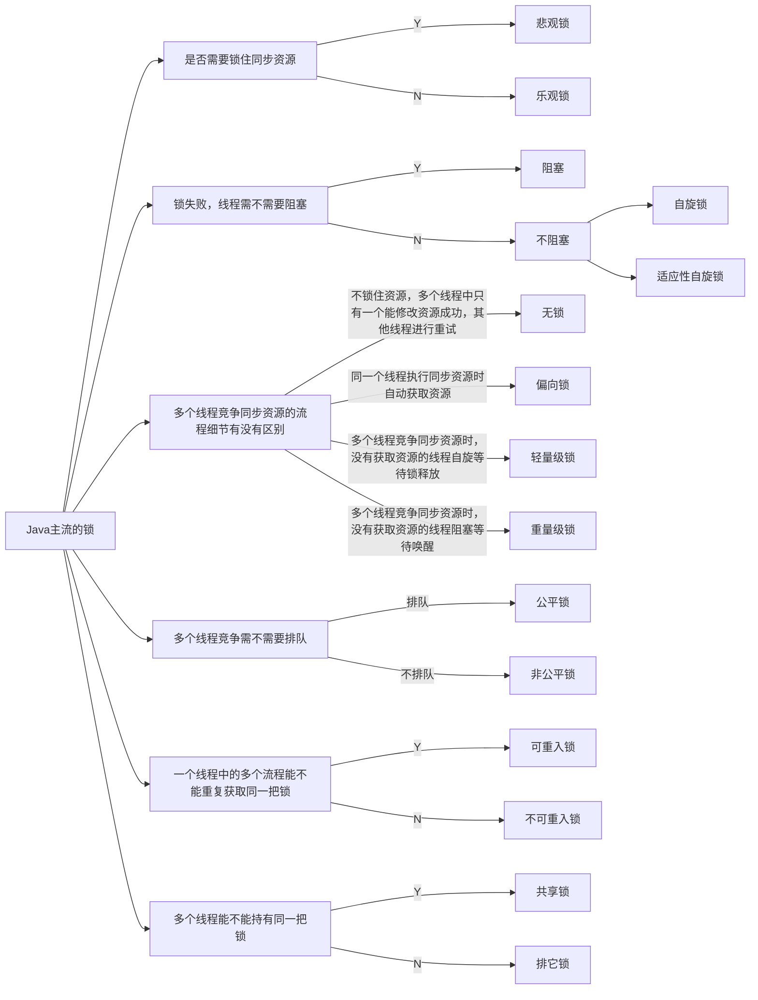
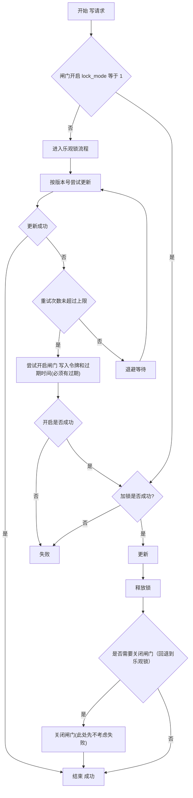

# 锁
- 阻塞或唤醒一个Java线程需要操作系统切换CPU状态来完成，**这种状态转换需要耗费处理器时间**。如果同步代码块中的内容过于简单，状态转换消耗的时间有可能比用户代码执行的时间还要长。

## 1.乐观锁与悲观锁
> 乐观锁与悲观锁是一种广义上的概念，体现了看待线程同步的不同角度。在Java和数据库中都有此概念对应的实际应用。

先说概念。对于同一个数据的并发操作，悲观锁认为自己在使用数据的时候一定有别的线程来修改数据，因此在获取数据的时候会先加锁，确保数据不会被别的线程修改。Java中，synchronized关键字和Lock的实现类都是悲观锁。

而乐观锁认为自己在使用数据时不会有别的线程修改数据，所以不会添加锁，只是在更新数据的时候去判断之前有没有别的线程更新了这个数据。如果这个数据没有被更新，当前线程将自己修改的数据成功写入。如果数据已经被其他线程更新，则根据不同的实现方式执行不同的操作（例如报错或者自动重试）。

乐观锁在Java中是通过使用无锁编程来实现，最常采用的是CAS算法，Java原子类中的递增操作就通过CAS自旋实现的。

## 2. 自旋锁 VS 适应性自旋锁
阻塞或唤醒一个Java线程需要操作系统切换CPU状态来完成，这种状态转换需要耗费处理器时间。如果同步代码块中的内容过于简单，状态转换消耗的时间有可能比用户代码执行的时间还要长。

在许多场景中，同步资源的锁定时间很短，为了这一小段时间去切换线程，线程挂起和恢复现场的花费可能会让系统得不偿失。如果物理机器有多个处理器，能够让两个或以上的线程同时并行执行，我们就可以让后面那个请求锁的线程不放弃CPU的执行时间，看看持有锁的线程是否很快就会释放锁。

而为了让当前线程“稍等一下”，我们需让当前线程进行自旋，如果在自旋完成后前面锁定同步资源的线程已经释放了锁，那么当前线程就可以不必阻塞而是直接获取同步资源，从而避免切换线程的开销。这就是自旋锁。

自旋锁本身是有缺点的，它不能代替阻塞。自旋等待虽然避免了线程切换的开销，但它要占用处理器时间。如果锁被占用的时间很短，自旋等待的效果就会非常好。反之，如果锁被占用的时间很长，那么自旋的线程只会白浪费处理器资源。所以，自旋等待的时间必须要有一定的限度，如果自旋超过了限定次数（默认是10次，可以使用-XX:PreBlockSpin来更改）没有成功获得锁，就应当挂起线程。

自旋锁的实现原理同样也是CAS，AtomicInteger中调用unsafe进行自增操作的源码中的do-while循环就是一个自旋操作，如果修改数值失败则通过循环来执行自旋，直至修改成功。

自旋锁相关可以看关键字 - synchronized详解 - 自旋锁与自适应自旋锁

## 3. 无锁 VS 偏向锁 VS 轻量级锁 VS 重量级锁
> 这四种锁是指锁的状态，专门针对synchronized的。在介绍这四种锁状态之前还需要介绍一些额外的知识。

总结而言： 偏向锁通过对比Mark Word解决加锁问题，避免执行CAS操作。而轻量级锁是通过用CAS操作和自旋来解决加锁问题，避免线程阻塞和唤醒而影响性能。重量级锁是将除了拥有锁的线程以外的线程都阻塞。

## 4. 公平锁 VS 非公平锁
公平锁是指多个线程按照申请锁的顺序来获取锁，线程直接进入队列中排队，队列中的第一个线程才能获得锁。公平锁的优点是等待锁的线程不会饿死。缺点是整体吞吐效率相对非公平锁要低，等待队列中除第一个线程以外的所有线程都会阻塞，CPU唤醒阻塞线程的开销比非公平锁大。

非公平锁是多个线程加锁时直接尝试获取锁，获取不到才会到等待队列的队尾等待。但如果此时锁刚好可用，那么这个线程可以无需阻塞直接获取到锁，所以非公平锁有可能出现后申请锁的线程先获取锁的场景。非公平锁的优点是**可以减少唤起线程的开销，整体的吞吐效率高**，因为线程**有几率不阻塞直接获得锁，CPU不必唤醒所有线程**。缺点是处于等待队列中的线程可能会饿死，或者等很久才会获得锁。

## 5. 可重入锁 VS 非可重入锁
可重入锁又名递归锁，是指在同一个线程在外层方法获取锁的时候，再进入该线程的内层方法会自动获取锁（前提锁对象得是同一个对象或者class），不会因为之前已经获取过还没释放而阻塞。Java中ReentrantLock和synchronized都是可重入锁，可重入锁的一个优点是可一定程度避免死锁。

### How
ReentrantLock和synchronized都是重入锁，那么我们通过重入锁ReentrantLock以及非可重入锁NonReentrantLock的源码来对比分析一下为什么非可重入锁在重复调用同步资源时会出现死锁。

首先ReentrantLock和NonReentrantLock都继承父类AQS，其父类AQS中维护了一个同步状态status来计数重入次数，status初始值为0。

当线程尝试获取锁时，可重入锁先尝试获取并更新status值，如果status == 0表示没有其他线程在执行同步代码，则把status置为1，当前线程开始执行。如果status != 0，则判断当前线程是否是获取到这个锁的线程，如果是的话执行status+1，且当前线程可以再次获取锁。而非可重入锁是直接去获取并尝试更新当前status的值，如果status != 0的话会导致其获取锁失败，当前线程阻塞。

释放锁时，可重入锁同样先获取当前status的值，在当前线程是持有锁的线程的前提下。如果status-1 == 0，则表示当前线程所有重复获取锁的操作都已经执行完毕，然后该线程才会真正释放锁。而非可重入锁则是在确定当前线程是持有锁的线程之后，直接将status置为0，将锁释放。
## 6. 独享锁(排他锁) VS 共享锁
> 独享锁和共享锁同样是一种概念。我们先介绍一下具体的概念，然后通过ReentrantLock和ReentrantReadWriteLock的源码来介绍独享锁和共享锁。

独享锁也叫排他锁，是指该锁一次只能被一个线程所持有。如果线程T对数据A加上排它锁后，则其他线程不能再对A加任何类型的锁。获得排它锁的线程即能读数据又能修改数据。JDK中的synchronized和JUC中Lock的实现类就是互斥锁。

共享锁是指该锁可被多个线程所持有。如果线程T对数据A加上共享锁后，则其他线程只能对A再加共享锁，不能加排它锁。获得共享锁的线程只能读数据，不能修改数据。

独享锁与共享锁也是通过AQS来实现的，通过实现不同的方法，来实现独享或者共享。

关于 `ReentrantReadWriteLock`，基于`AQS`实现，内部记录 写线程和写锁次数+读总数和每线程读锁次数

## 适用性思考
可以从以下维度评估并发控制方案的适用性：

- 是否允许失败：是否允许快速失败并由上层重试或补偿
- 读写场景：读多写少还是写多读少，是否存在热点键
- 性能目标：吞吐优先还是延迟优先
多数常见业务属于读多写少且延迟优先，因此通常优先选择无锁或少锁方案。

在强一致性要求不高，或者调用方能够控制重试的前提下，可以优先使用乐观锁解决写冲突：先按版本号尝试更新，并限制重试次数。当冲突持续且达到阈值时，再进入降级策略，例如快速失败，或者切换到加锁路径处理。

但需要注意，一旦引入加锁路径，如果仍然存在其他线程绕过加锁流程继续写入，那么即使当前线程拿到锁，也无法形成真正的排它更新，锁会退化为“部分线程自觉排队”，并不能保证修改一定成功。为避免该问题，需要在写入入口增加统一的并发协议，也就是“写入闸门”：

- 任意线程在进行写操作前，必须先读取闸门标识
- 若闸门未开启，走乐观锁快速路径
- 若闸门已开启，跳过乐观锁，直接进入加锁流程
- 闸门必须设置过期时间，避免异常情况下长期阻塞

这样可以确保在热点冲突阶段，所有写请求都会收敛到同一条排它路径，从而实现真正意义上的互斥更新。

流程图如下

> 注：上面存在大量未考虑的问题，如：读到的数据的一致性问题，锁是否成功，闸门是否成功，快速失败等。

### 1）阈值不是固定值，需要和延迟目标绑定
- 延迟优先：阈值应偏小，超过阈值更倾向快速失败而不是排队等待
- 吞吐优先：阈值可偏大，允许更多重试或等待锁

可以描述为：阈值本质是在“平均成功率”和“尾部延迟”之间做权衡。

### 2）闸门开启与关闭需要“所有权”防止误关
建议给闸门增加令牌字段（例如 gate_token），开启闸门时写入令牌，关闭闸门时必须校验令牌匹配，避免把其他线程刚开启的闸门关掉。

> 短示例： 关闭闸门条件: id 相同 且 gate_token 相同

### 3）加锁方式要与存储一致
- 如果写操作最终落在数据库，优先考虑数据库行级锁来提供排它性
- 如果是跨服务资源，需要分布式锁，但必须保证所有写请求都遵守闸门检查

## 分段思路
当热点写非常集中时，与其不断升级锁，不如从数据结构上拆分冲突面，把“共享写”改造成“可分摊写”，典型做法包括：

- 分桶累加：类似 LongAdder，将同一指标拆到多个桶，写入只竞争桶内，读取再聚合
- 分桶库存：例如秒杀库存拆成多个桶，用户按哈希取模进入固定桶竞争，降低单点冲突
- 事件化写入：把“更新最终值”改为“追加事件”，由异步合并线程汇总落库

这些方案的共同点是把竞争从“同一行同一字段”扩散到“多个分片”，从而显著降低冲突概率。

## 类比说明
类似于虚拟机内存分配中的线程本地分配缓冲区 LTAB 思路，预先将资源按线程或分片进行划分并分配。线程在自己的分配区间内仅需移动指针顺序获取即可，不再对共享位置进行写入操作，从结构上消除并发写竞争。