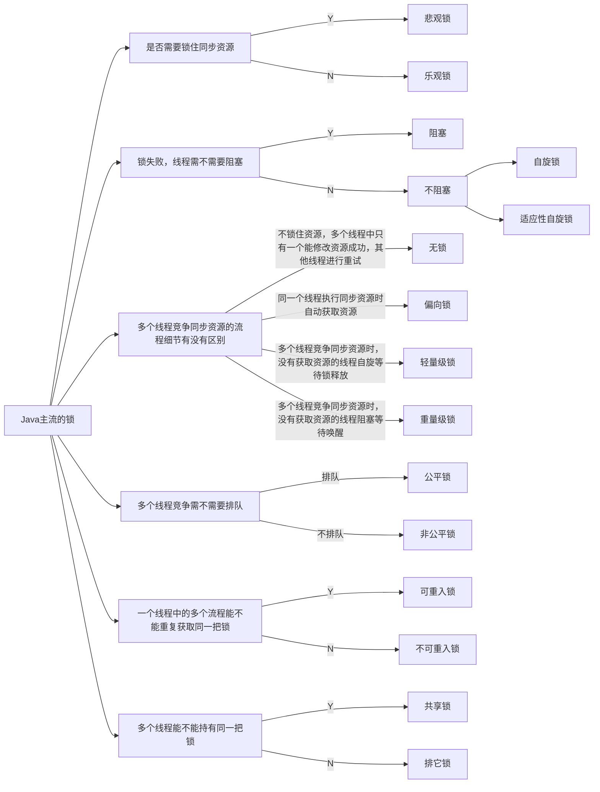
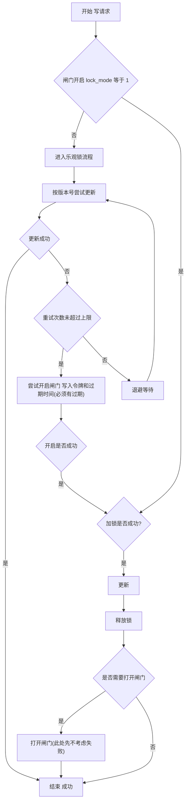

# 锁
- 阻塞或唤醒一个Java线程需要操作系统切换CPU状态来完成，这种状态转换需要耗费处理器时间。如果同步代码块中的内容过于简单，状态转换消耗的时间有可能比用户代码执行的时间还要长。

## 1.乐观锁与悲观锁
> 乐观锁与悲观锁是一种广义上的概念，体现了看待线程同步的不同角度。在Java和数据库中都有此概念对应的实际应用。

先说概念。对于同一个数据的并发操作，悲观锁认为自己在使用数据的时候一定有别的线程来修改数据，因此在获取数据的时候会先加锁，确保数据不会被别的线程修改。Java中，synchronized关键字和Lock的实现类都是悲观锁。

而乐观锁认为自己在使用数据时不会有别的线程修改数据，所以不会添加锁，只是在更新数据的时候去判断之前有没有别的线程更新了这个数据。如果这个数据没有被更新，当前线程将自己修改的数据成功写入。如果数据已经被其他线程更新，则根据不同的实现方式执行不同的操作（例如报错或者自动重试）。

乐观锁在Java中是通过使用无锁编程来实现，最常采用的是CAS算法，Java原子类中的递增操作就通过CAS自旋实现的。

## 2. 自旋锁 VS 适应性自旋锁

## 3. 无锁 VS 偏向锁 VS 轻量级锁 VS 重量级锁

## 4. 公平锁 VS 非公平锁

## 5. 可重入锁 VS 非可重入锁

## 6. 独享锁(排他锁) VS 共享锁

## 适用性思考

可以简单的按照如下几个维度思考

- 是否允许失败
- 读写场景
- 吞吐优先？延迟优先？

常见的业务领域都是读多写少，且延迟优先的。

那在这种情况下，如果对于数据的强一致性要求不高，或者实际资源调用者可以控制重试时，可以使用乐观锁先尝试解决，并且设置一个阈值，如果到达阈值，仍然无法成功处理，可以降级（快速失败），或者进行锁尝试，但一旦开始锁，则要考虑其他线程的并发成本，即：即使加了锁，其他线程由于没有进入锁的流程，你拿到了锁，也无法正常的修改，因为没有排它锁，所以这样的话，在第一步就要快速判断是否已经进入锁环节，即：任意一个线程，进入资源的操作时，都要先看一个是否开启锁标识，如果已经开启，则不需要进行乐观锁的尝试，直接进入锁的流程。

流程图如下

> 注：上面存在大量未考虑的问题，如：读到的数据的一致性问题，锁的释放是否成功，闸门的成功失败，快速失败等。

本质是，分级处理问题，将一般性和特殊场景进行区分。

也可以根据业务，将资源分段处理，如`LongAdder`，将多次加的值，加入不同的桶中，最后再计算和，类似秒杀，可以将用户先隔离到不同的桶中，如100*n个库存，存100个桶，用户hash取模，进入不同的桶竞争等。

类似于 `虚拟机`内存划分中的 `线程本地分配缓冲区 LTAB` 思路，预先将内存按线程划分并分配，每个线程只需按自身指针地址顺序获取即可，从结构上避免共享写入，因而不再产生并发竞争问题。
