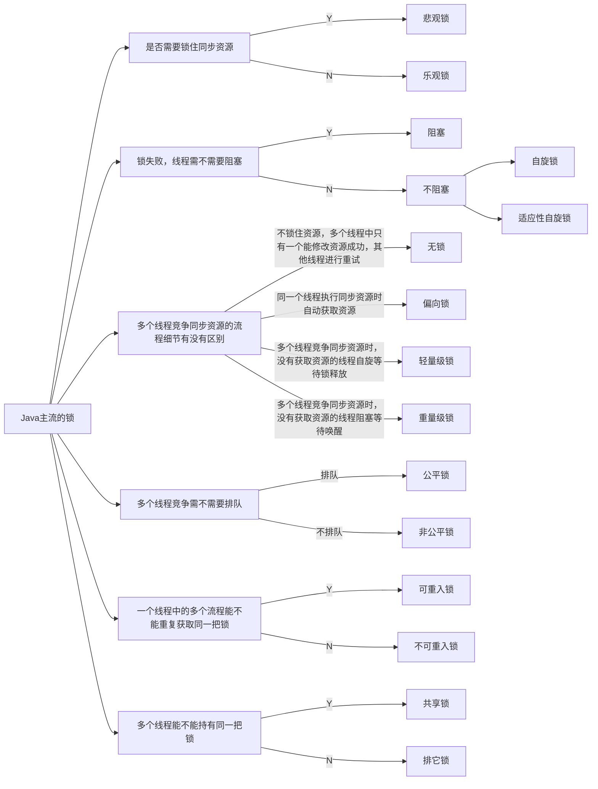
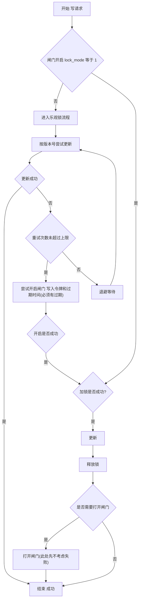

# 锁
- 阻塞或唤醒一个Java线程需要操作系统切换CPU状态来完成，这种状态转换需要耗费处理器时间。如果同步代码块中的内容过于简单，状态转换消耗的时间有可能比用户代码执行的时间还要长。

## 1.乐观锁与悲观锁
> 乐观锁与悲观锁是一种广义上的概念，体现了看待线程同步的不同角度。在Java和数据库中都有此概念对应的实际应用。

先说概念。对于同一个数据的并发操作，悲观锁认为自己在使用数据的时候一定有别的线程来修改数据，因此在获取数据的时候会先加锁，确保数据不会被别的线程修改。Java中，synchronized关键字和Lock的实现类都是悲观锁。

而乐观锁认为自己在使用数据时不会有别的线程修改数据，所以不会添加锁，只是在更新数据的时候去判断之前有没有别的线程更新了这个数据。如果这个数据没有被更新，当前线程将自己修改的数据成功写入。如果数据已经被其他线程更新，则根据不同的实现方式执行不同的操作（例如报错或者自动重试）。

乐观锁在Java中是通过使用无锁编程来实现，最常采用的是CAS算法，Java原子类中的递增操作就通过CAS自旋实现的。

## 2. 自旋锁 VS 适应性自旋锁

## 3. 无锁 VS 偏向锁 VS 轻量级锁 VS 重量级锁

## 4. 公平锁 VS 非公平锁

## 5. 可重入锁 VS 非可重入锁

## 6. 独享锁(排他锁) VS 共享锁

## 适用性思考
可以从以下维度评估并发控制方案的适用性：

- 是否允许失败：是否允许快速失败并由上层重试或补偿
- 读写场景：读多写少还是写多读少，是否存在热点键
- 性能目标：吞吐优先还是延迟优先
多数常见业务属于读多写少且延迟优先，因此通常优先选择无锁或少锁方案。

在强一致性要求不高，或者调用方能够控制重试的前提下，可以优先使用乐观锁解决写冲突：先按版本号尝试更新，并限制重试次数。当冲突持续且达到阈值时，再进入降级策略，例如快速失败，或者切换到加锁路径处理。

但需要注意，一旦引入加锁路径，如果仍然存在其他线程绕过加锁流程继续写入，那么即使当前线程拿到锁，也无法形成真正的排它更新，锁会退化为“部分线程自觉排队”，并不能保证修改一定成功。为避免该问题，需要在写入入口增加统一的并发协议，也就是“写入闸门”：

- 任意线程在进行写操作前，必须先读取闸门标识
- 若闸门未开启，走乐观锁快速路径
- 若闸门已开启，跳过乐观锁，直接进入加锁流程
- 闸门必须设置过期时间，避免异常情况下长期阻塞

这样可以确保在热点冲突阶段，所有写请求都会收敛到同一条排它路径，从而实现真正意义上的互斥更新。

流程图如下

> 注：上面存在大量未考虑的问题，如：读到的数据的一致性问题，锁的释放是否成功，闸门的成功失败，快速失败等。

### 1）阈值不是固定值，需要和延迟目标绑定
- 延迟优先：阈值应偏小，超过阈值更倾向快速失败而不是排队等待
- 吞吐优先：阈值可偏大，允许更多重试或等待锁

可以描述为：阈值本质是在“平均成功率”和“尾部延迟”之间做权衡。

### 2）闸门开启与关闭需要“所有权”防止误关
建议给闸门增加令牌字段（例如 gate_token），开启闸门时写入令牌，关闭闸门时必须校验令牌匹配，避免把其他线程刚开启的闸门关掉。

> 短示例： 关闭闸门条件: id 相同 且 gate_token 相同

### 3）加锁方式要与存储一致
- 如果写操作最终落在数据库，优先考虑数据库行级锁来提供排它性
- 如果是跨服务资源，需要分布式锁，但必须保证所有写请求都遵守闸门检查

## 分段思路
当热点写非常集中时，与其不断升级锁，不如从数据结构上拆分冲突面，把“共享写”改造成“可分摊写”，典型做法包括：

- 分桶累加：类似 LongAdder，将同一指标拆到多个桶，写入只竞争桶内，读取再聚合
- 分桶库存：例如秒杀库存拆成多个桶，用户按哈希取模进入固定桶竞争，降低单点冲突
- 事件化写入：把“更新最终值”改为“追加事件”，由异步合并线程汇总落库

这些方案的共同点是把竞争从“同一行同一字段”扩散到“多个分片”，从而显著降低冲突概率。

## 类比说明
类似于虚拟机内存分配中的线程本地分配缓冲区 LTAB 思路，预先将资源按线程或分片进行划分并分配。线程在自己的分配区间内仅需移动指针顺序获取即可，不再对共享位置进行写入操作，从结构上消除并发写竞争。