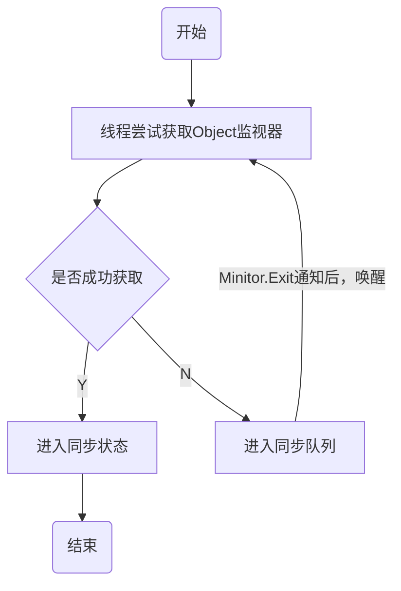
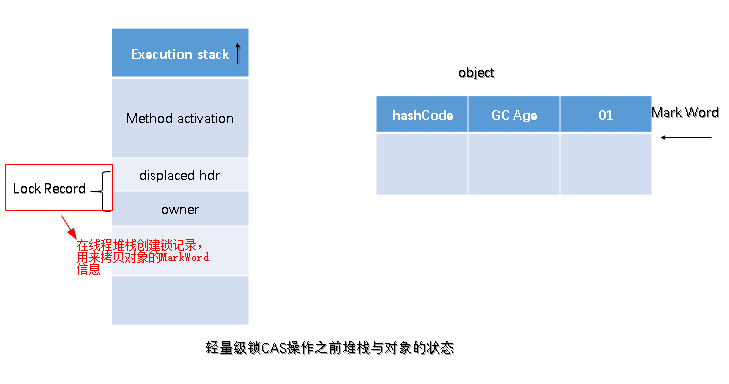
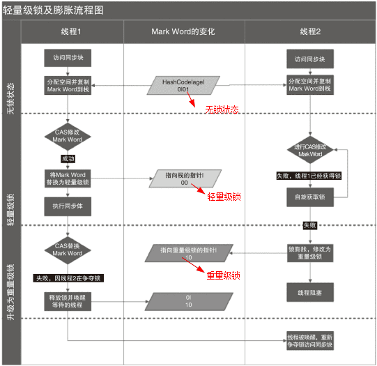
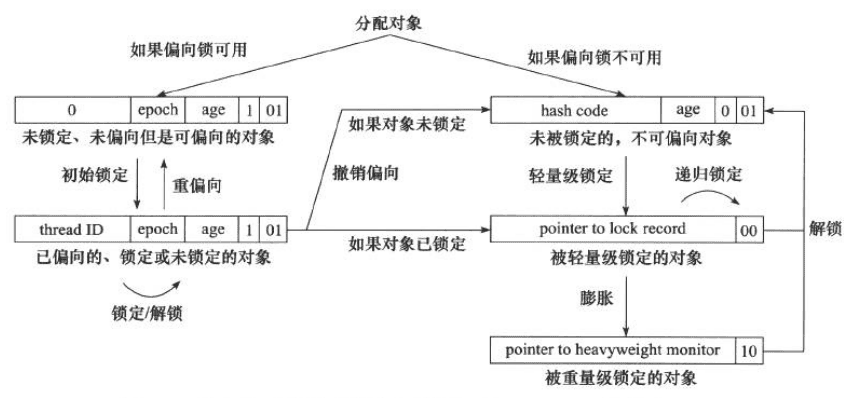
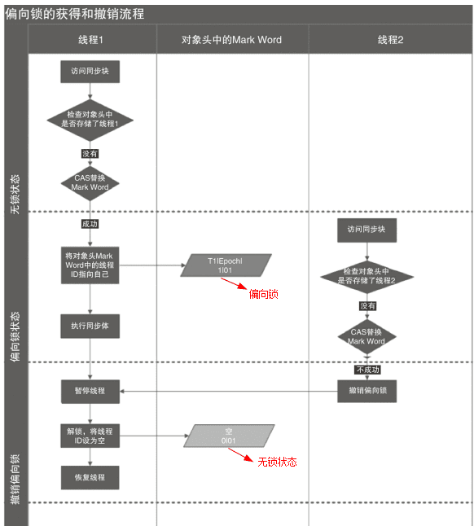

# synchronized
## Synchronized的使用
在应用Sychronized关键字时需要把握如下注意点：

- 一把锁只能同时被一个线程获取，没有获得锁的线程只能等待；
- 每个实例都对应有自己的一把锁(this),不同实例之间互不影响；例外：锁对象是*.class以及synchronized修饰的是static方法的时候，所有对象公用同一把锁
- synchronized修饰的方法，无论方法正常执行完毕还是抛出异常，都会释放锁

### 对象锁
包括方法锁(默认锁对象为this,当前实例对象)和同步代码块锁(自己指定锁对象)

#### **代码块形式：手动指定锁定对象，也可是是this,也可以是自定义的锁**
```java
synchronized (this) {
    // 锁当前对象
    try {
        Thread.sleep(1000);
    } catch (InterruptedException e) {
        throw new RuntimeException(e);
    }
}
...
Object o1 = new Object();
synchronized (o1) {
    // 锁指定对象
    try {
        Thread.sleep(1000);
    } catch (InterruptedException e) {
        throw new RuntimeException(e);
    }
}
...
public synchronized void run() {
    // synchronized修饰普通方法，锁对象默认为this
    count++;
    System.out.println(name + ": " + count);
    try {
        Thread.sleep(1000);
    } catch (InterruptedException e) {
        throw new RuntimeException(e);
    }
}

```


### 类锁
指synchronize修饰静态的方法或指定锁对象为Class对象
> 注意：不同类的锁并非同一个。`synchronized(A.class) `和`synchronized(B.class)`可以同时运行。

- synchronize修饰静态方法
- synchronized指定锁对象为Class对象

## Synchronized原理分析

### 加锁和释放锁的原理


> ⚠️：此处未说明可重入问题，且未展开说明对象监视器和同步队列

任意线程对Object的访问，首先要获得Object的监视器，如果获取失败，该线程就进入同步状态，线程状态变为BLOCKED，当Object的监视器占有者释放后，在同步队列中得线程就会有机会重新获取该监视器。

> 进入同步块失败的等待线程想进入 synchronized (obj) {} 或进入 synchronized 方法，但拿不到 obj 的监视器，线程进入“监视器的同步队列”等待，Java 线程状态通常显示为 BLOCKED

> 为什么释放后是“有机会重新获取”，而不是立刻获取？因为释放监视器后，监视器只会唤醒或放行一个或多个等待线程去竞争，但并不保证公平顺序。因此只说“有机会重新获取”。

### 可重入原理：加锁次数计数器
- 可重入：（来源于维基百科）若一个程序或子程序可以“在任意时刻被中断然后操作系统调度执行另外一段代码，这段代码又调用了该子程序不会出错”，则称其为可重入（reentrant或re-entrant）的。即当该子程序正在运行时，执行线程可以再次进入并执行它，仍然获得符合设计时预期的结果。与多线程并发执行的线程安全不同，可重入强调对单个线程执行时重新进入同一个子程序仍然是安全的。

- 可重入锁：又名递归锁，是指在同一个线程在外层方法获取锁的时候，再进入该线程的内层方法会自动获取锁（前提锁对象得是同一个对象或者class），不会因为之前已经获取过还没释放而阻塞。

- 即在同一锁程中，每个对象拥有一个monitor计数器，当线程获取该对象锁后，monitor计数器就会加一，释放锁后就会将monitor计数器减一，线程不需要再次获取同一把锁。


### 保证可见性的原理：内存模型和happens-before规则
- Synchronized的happens-before规则，即监视器锁规则：对同一个监视器的解锁，happens-before于对该监视器的加锁。

- 通过上面的这个，可以推导出可见性，如果A happens-before B，则A的执行结果对B可见，并且A的执行顺序先于B。线程A先对共享变量a（=0）进行加一，由happens-before关系可知线程A的执行结果对线程B可见即线程B所读取到的a的值为1。

## JVM中锁的优化

简单来说在JVM中`monitorenter`和`monitorexit`字节码依赖于底层的操作系统的`Mutex Lock`来实现的，但是由于使用`Mutex Lock`需要将当前线程挂起并从用户态切换到内核态来执行，这种切换的代价是非常昂贵的；然而在现实中的大部分情况下，同步方法是运行在单线程环境(无锁竞争环境)如果每次都调用Mutex Lock那么将严重的影响程序的性能。不过在jdk1.6中对锁的实现引入了大量的优化，如锁粗化(Lock Coarsening)、锁消除(Lock Elimination)、轻量级锁(Lightweight Locking)、偏向锁(Biased Locking)、适应性自旋(Adaptive Spinning)等技术来减少锁操作的开销。
- 锁粗化(Lock Coarsening)：也就是减少不必要的紧连在一起的unlock，lock操作，将多个连续的锁扩展成一个范围更大的锁。

- 锁消除(Lock Elimination)：通过运行时JIT编译器的逃逸分析来消除一些没有在当前同步块以外被其他线程共享的数据的锁保护，通过逃逸分析也可以在线程本的Stack上进行对象空间的分配(同时还可以减少Heap上的垃圾收集开销)。

- 轻量级锁(Lightweight Locking)：这种锁实现的背后基于这样一种假设，即在真实的情况下我们程序中的大部分同步代码一般都处于无锁竞争状态(即单线程执行环境)，在无锁竞争的情况下完全可以避免调用操作系统层面的重量级互斥锁，取而代之的是在monitorenter和monitorexit中只需要依靠一条CAS原子指令就可以完成锁的获取及释放。当存在锁竞争的情况下，执行CAS指令失败的线程将调用操作系统互斥锁进入到阻塞状态，当锁被释放的时候被唤醒(具体处理步骤下面详细讨论)。

- 偏向锁(Biased Locking)：是为了在**无锁竞争**的情况下避免在锁获取过程中执行不必要的`CAS原子指令`，因为CAS原子指令虽然相对于重量级锁来说开销比较小但还是存在非常可观的本地延迟。

- 适应性自旋(Adaptive Spinning)：当线程在获取轻量级锁的过程中执行CAS操作失败时，在进入与monitor相关联的操作系统重量级锁(mutex semaphore)前会进入忙等待(Spinning)然后再次尝试，当尝试一定的次数后如果仍然没有成功则调用与该monitor关联的semaphore(即互斥锁)进入到阻塞状态。

### 锁的类型
在Java SE 1.6里Synchronied同步锁，一共有四种状态：无锁、偏向锁、轻量级锁、重量级锁，它会随着竞争情况逐渐升级。锁可以升级但是不可以降级，目的是为了提供获取锁和释放锁的效率。

> 锁膨胀方向： 无锁 → 偏向锁 → 轻量级锁 → 重量级锁 (此过程是不可逆的)

### 自旋锁与自适应自旋锁
#### 自旋锁
> 引入背景：大家都知道，在没有加入锁优化时，Synchronized是一个非常“胖大”的家伙。在多线程竞争锁时，当一个线程获取锁时，它会阻塞所有正在竞争的线程，这样对性能带来了极大的影响。在挂起线程和恢复线程的操作都需要转入内核态中完成，这些操作对系统的并发性能带来了很大的压力。同时HotSpot团队注意到在很多情况下，**共享数据的锁定状态只会持续很短的一段时间**，为了这段时间去挂起和回复阻塞线程并不值得。在如今多处理器环境下，完全可以让另一个没有获取到锁的线程在门外等待一会(**自旋**)，但不放弃CPU的执行时间。等待持有锁的线程是否很快就会释放锁。为了让线程等待，我们只需要让线程执行一个忙循环(自旋)，这便是自旋锁由来的原因。

自旋锁早在JDK1.4 中就引入了，只是当时默认时关闭的。在JDK 1.6后默认为开启状态。自旋锁本质上与阻塞并不相同，先不考虑其对多处理器的要求，如果锁占用的时间非常的短，那么自旋锁的性能会非常的好，相反，其会带来更多的性能开销(因为在线程自旋时，始终会占用CPU的时间片，如果锁占用的时间太长，那么自旋的线程会白白消耗掉CPU资源)。因此自旋等待的时间必须要有一定的限度，如果自旋超过了限定的次数仍然没有成功获取到锁，就应该使用传统的方式去挂起线程了，在JDK定义中，**自旋锁默认的自旋次数为10次，用户可以使用参数-XX:PreBlockSpin来更改**。

可是现在又出现了一个问题：如果线程锁在线程自旋刚结束就释放掉了锁，那么是不是有点得不偿失。所以这时候我们需要更加聪明的锁来实现更加灵活的自旋。来提高并发的性能。(这里则需要自适应自旋锁！)

#### 自适应自旋锁
在JDK 1.6中引入了自适应自旋锁。这就意味着自旋的时间不再固定了，而是由前一次在同一个锁上的自旋 时间及锁的拥有者的状态来决定的。如果在同一个锁对象上，自旋等待刚刚成功获取过锁，并且持有锁的线程正在运行中，那么JVM会认为该锁自旋获取到锁的可能性很大，会自动增加等待时间。比如增加到100次循环。相反，如果对于某个锁，自旋很少成功获取锁。那再以后要获取这个锁时将可能省略掉自旋过程，以避免浪费处理器资源。有了自适应自旋，JVM对程序的锁的状态预测会越来越准确，JVM也会越来越聪明。

### 锁消除
锁消除是指虚拟机即时编译器再运行时，对一些代码上要求同步，但是被检测到不可能存在共享数据竞争的锁进行消除。锁消除的主要判定依据来源于逃逸分析的数据支持。意思就是：JVM会判断再一段程序中的同步明显不会逃逸出去从而被其他线程访问到，那JVM就把它们当作栈上数据对待，认为这些数据是线程独有的，不需要加同步。此时就会进行锁消除。

​当然在实际开发中，我们很清楚的知道哪些是线程独有的，不需要加同步锁，但是在Java API中有很多方法都是加了同步的，那么此时JVM会判断这段代码是否需要加锁。如果数据并不会逃逸，则会进行锁消除。比如如下操作：在操作String类型数据时，由于String是一个不可变类，对字符串的连接操作总是通过生成的新的String对象来进行的。因此Javac编译器会对String连接做自动优化。在JDK 1.5之前会使用StringBuffer对象的连续append()操作，在JDK 1.5及以后的版本中，会转化为StringBuidler对象的连续append()操作。

```java
public static String test03(String s1, String s2, String s3) {
    String s = s1 + s2 + s3;
    return s;
}
```

### 锁粗化
原则上，我们都知道在加同步锁时，尽可能的将同步块的作用范围限制到尽量小的范围(只在共享数据的实际作用域中才进行同步，这样是为了使得需要同步的操作数量尽可能变小。在存在锁同步竞争中，也可以使得等待锁的线程尽早的拿到锁)。

​大部分上述情况是完美正确的，但是如果存在连串的一系列操作都对同一个对象反复加锁和解锁，甚至加锁操作时出现在循环体中的，那即使没有线程竞争，频繁的进行互斥同步操作也会导致不必要的性能操作。


### 轻量级锁

在JDK 1.6之后引入的轻量级锁，需要注意的是轻量级锁并不是替代重量级锁的，而是对在大多数情况下同步块并不会有竞争出现提出的一种优化。它可以减少重量级锁对线程的阻塞带来的线程开销。从而提高并发性能。

​如果要理解轻量级锁，那么必须先要了解HotSpot虚拟机中对象头的内存布局。上面介绍Java对象头也详细介绍过。在对象头中(Object Header)存在两部分。第一部分用于存储对象自身的运行时数据，HashCode、GC Age、锁标记位、是否为偏向锁。等。一般为32位或者64位(视操作系统位数定)。官方称之为`Mark Word`，它是实现轻量级锁和偏向锁的关键。 另外一部分存储的是指向方法区对象类型数据的指针(Klass Point)，如果对象是数组的话，还会有一个额外的部分用于存储数据的长度。

#### 轻量级锁加锁
在线程执行同步块之前，JVM会先在当前线程的**栈帧**中创建一个名为锁记录(`Lock Record`)的空间，用于存储锁对象目前的`Mark Word`的`拷贝`(JVM会将对象头中的`Mark Word`拷贝到锁记录中，官方称为`Displaced Mark Ward`)这个时候线程堆栈与对象头的状态如图：


#### 锁膨胀过程


### 偏向锁
> 引入背景：在大多实际环境下，锁不仅不存在多线程竞争，而且总是由同一个线程多次获取，那么在同一个线程反复获取所释放锁中，其中并还没有锁的竞争，那么这样看上去，多次的获取锁和释放锁带来了很多不必要的性能开销和上下文切换。

​为了解决这一问题，HotSpot的作者在Java SE 1.6 中对Synchronized进行了优化，引入了偏向锁。当一个线程访问同步块并获取锁时，会在对象头和栈帧中的锁记录里存储锁偏向的线程ID，以后该线程在进入和退出同步块时不需要进行CAS操作来加锁和解锁。只需要简单的测试一下对象头的`Mark Word`里是否存储着指向当前线程的偏向锁。如果成功，表示线程已经获取到了锁。


#### 偏向锁的撤销
 偏向锁使用了一种等待竞争出现才会释放锁的机制。所以当其他线程尝试获取偏向锁时，持有偏向锁的线程才会释放锁。但是偏向锁的撤销需要等到全局安全点(就是当前线程没有正在执行的字节码)。它会首先暂停拥有偏向锁的线程，让你后检查持有偏向锁的线程是否活着。如果线程不处于活动状态，直接将对象头设置为无锁状态。如果线程活着，JVM会遍历栈帧中的锁记录，栈帧中的锁记录和对象头要么偏向于其他线程，要么恢复到无锁状态或者标记对象不适合作为偏向锁。


当前持有偏向锁的线程并不是“主动知道要释放”，而是在其他线程来竞争这把锁时，被虚拟机触发撤销流程后才会配合释放。偏向锁的核心思想就是：没有竞争就一直偏向，不做释放动作；只有出现竞争，才撤销或转成其他形态的锁。

下面按“谁触发，怎么通知，持有者怎么配合”把机制说清楚。

1. 触发条件：别的线程来获取同一把锁
线程1 已经让对象处于偏向状态，对象头 Mark Word 里记录了线程1的线程标识
线程2 进入同步块时检查对象头，发现偏向的是线程1而不是自己
这时线程2会走到“偏向锁撤销”路径，向虚拟机发起撤销请求
也就是说，竞争者线程是触发者。

2. “需要释放”的信息来自虚拟机，而不是来自线程1自己判断
偏向锁撤销属于虚拟机的运行时管理动作，常见做法是：

线程2 请求撤销后，虚拟机会在合适时机把系统带到全局安全点
到了安全点，虚拟机可以“稳定地”检查线程状态与栈帧
因此，“线程1需要释放偏向”这个结论，是虚拟机在撤销流程里做出的，而不是线程1在运行过程中靠轮询对象头发现的。

3. 持有偏向的线程1如何配合“释放”
偏向锁并不像重量级锁那样有一个必须执行的“unlock”操作。线程1的配合主要体现在两点：

到安全点时线程1会被暂停
虚拟机暂停线程1，保证它不在执行相关临界区字节码，栈和对象头状态不会再变化。

虚拟机检查线程1的锁记录并修正对象头
虚拟机会遍历线程1的栈帧中的锁记录，判断当前这把锁是否仍然在使用，然后做下面之一：

线程1未持有或已离开同步块：对象头恢复到无锁或可重新偏向
线程1仍在同步块内：撤销偏向，并通常**升级为轻量级锁或直接膨胀为重量级锁（取决于竞争情况）**
所以严格来说：不是线程1执行某个释放动作，而是虚拟机在安全点重写对象头和相关锁记录，完成“撤销偏向”。
x
4. 线程2怎么做到的等待
- 方式一：线程二自旋加让出处理器，等待一个状态变化
- 方式二：线程二进入可唤醒的等待，等虚拟机发信号


### 锁的优缺点对比
锁|	优点	|缺点|	使用场景
-|-|-|-
偏向锁|加锁和解锁不需要CAS操作，没有额外的性能消耗，和执行非同步方法相比仅存在纳秒级的差距|如果线程间存在锁竞争，会带来额外的锁撤销的消耗|适用于只有一个线程访问同步块的场景
轻量级锁|竞争的线程不会阻塞，提高了响应速度|如线程始终得不到锁竞争的线程，使用自旋会消耗CPU性能|追求响应时间，同步块执行速度非常快
重量级锁|线程竞争不适用自旋，不会消耗CPU|线程阻塞，响应时间缓慢，在多线程下，频繁的获取释放锁，会带来巨大的性能消耗|追求吞吐量，同步块执行速度较长

## Synchronized与Lock

### synchronized的缺陷
- 效率低：锁的释放情况少，只有代码执行完毕或者异常结束才会释放锁；试图获取锁的时候不能设定超时，不能中断一个正在使用锁的线程，相对而言，Lock可以中断和设置超时
- 不够灵活：加锁和释放的时机单一，每个锁仅有一个单一的条件(某个对象)，相对而言，读写锁更加灵活
- 无法知道是否成功获得锁，相对而言，Lock可以拿到状态，如果成功获取锁，....，如果获取失败，...

### Lock解决相应问题
Lock类这里不做过多解释，主要看里面的4个方法:

- lock(): 加锁
- unlock(): 解锁
- tryLock(): 尝试获取锁，返回一个boolean值
- tryLock(long,TimeUtil): 尝试获取锁，可以设置超时

Synchronized加锁只与一个条件(是否获取锁)相关联，不灵活，后来Condition与Lock的结合解决了这个问题。

多线程竞争一个锁时，其余未得到锁的线程只能不停的尝试获得锁，而不能中断。高并发的情况下会导致性能下降。ReentrantLock的lockInterruptibly()方法可以优先考虑响应中断。 一个线程等待时间过长，它可以中断自己，然后ReentrantLock响应这个中断，不再让这个线程继续等待。有了这个机制，使用ReentrantLock时就不会像synchronized那样产生死锁了。 


#### 产生死锁的四个必要条件：
- （1） 互斥条件：一个资源每次只能被一个进程使用。
- （2） 请求与保持条件：一个进程因请求资源而阻塞时，对已获得的资源保持不放。
- （3） 不剥夺条件:进程已获得的资源，在末使用完之前，不能强行剥夺。
- （4） 循环等待条件:若干进程之间形成一种头尾相接的循环等待资源关系。

- lockInterruptibly() 允许线程在等待锁期间响应中断并退出等待，更容易打破循环等待，但不保证不会死锁。
- tryLock(long, TimeUnit) 通过超时放弃等待，直接避免无限等待，从而更容易打破循环等待；若超时后释放已持有锁，还可避免请求与保持。

## 再深入理解

synchronized是通过软件(JVM)实现的，简单易用，即使在JDK5之后有了Lock，仍然被广泛的使用。

使用Synchronized有哪些要注意的？

- 锁对象不能为空，因为锁的信息都保存在对象头里
- 作用域不宜过大，影响程序执行的速度，控制范围过大，编写代码也容易出错
- 避免死锁
- 在能选择的情况下，既不要用Lock也不要用synchronized关键字，用java.util.concurrent包中的各种各样的类，如果不用该包下的类，在满足业务的情况下，可以使用synchronized关键，因为代码量少，避免出错
- synchronized实际上是非公平的，新来的线程有可能立即获得监视器，而在等待区中等候已久的线程可能再次等待，这样有利于提高性能，但是也可能会导致饥饿现象。