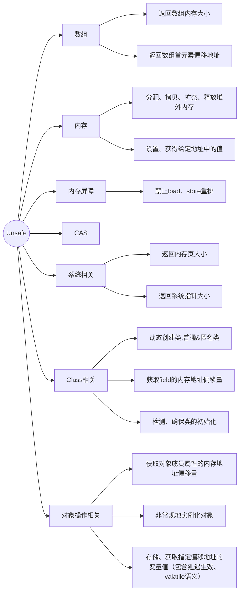

# CAS
## 什么是CAS
CAS的全称为Compare-And-Swap，直译就是对比交换。是一条CPU的原子指令，其作用是让CPU先进行比较两个值是否相等，然后原子地更新某个位置的值，经过调查发现，其实现方式是基于硬件平台的汇编指令，就是说**CAS是靠硬件实现**的，JVM只是封装了汇编调用，那些AtomicInteger类便是使用了这些封装后的接口。   简单解释：CAS操作需要输入两个数值，一个旧值(期望操作前的值)和一个新值，在操作期间先比较下在旧值有没有发生变化，如果没有发生变化，才交换成新值，发生了变化则不交换。

CAS操作是**原子性**的，所以多线程并发使用CAS更新数据时，可以不使用锁。JDK中大量使用了CAS来更新数据而防止加锁(synchronized 重量级锁)来保持原子更新。

相信sql大家都熟悉，类似sql中的条件更新一样：`update set id=3 from table where id=2`。因为单条sql执行具有原子性，如果有多个线程同时执行此sql语句，只有一条能更新成功。
> 由于sql执行会返回更新行数，可以基于行数判断是否成功。

## CAS使用示例
一般基于原子类使用，不直接使用，如果实在需要直接使用，请参考 `AtomicInteger`和`Unsafe`的源码
> Unsafe 大量的 native 方法。

## CAS 问题
### ABA问题
因为CAS需要在操作值的时候，检查值有没有发生变化，比如没有发生变化则更新，但是如果一个值原来是A，变成了B，又变成了A，那么使用CAS进行检查时则会发现它的值没有发生变化，但是实际上却变化了。

ABA问题的解决思路就是使用版本号。在变量前面追加上版本号，每次变量更新的时候把版本号加1，那么A->B->A就会变成1A->2B->3A。

从Java 1.5开始，JDK的Atomic包里提供了一个类`AtomicStampedReference`来解决ABA问题。这个类的compareAndSet方法的作用是首先检查当前引用是否等于预期引用，并且检查当前标志是否等于预期标志，如果全部相等，则以原子方式将该引用和该标志的值设置为给定的更新值。

```java
AtomicStampedReference<Integer> atomicStampedReference = new AtomicStampedReference<>(0, 0);
int[] stampHolder = new int[1];
for (;;) {
    // 改为 while 也可以，但for可读性更强
    Integer oldValue = atomicStampedReference.get(stampHolder); // 原子地获取引用和戳
    int oldStamp = stampHolder[0];
    Integer newValue = oldValue + 10;
    if (atomicStampedReference.compareAndSet(oldValue, newValue, oldStamp, oldStamp + 1)) {
        break;
    
    // CAS 失败则重试

```
### 循环时间长开销大
自旋CAS如果长时间不成功，会给CPU带来非常大的执行开销。如果JVM能支持处理器提供的pause指令，那么效率会有一定的提升。pause指令有两个作用：第一，它可以延迟流水线执行命令(de-pipeline)，使CPU不会消耗过多的执行资源，延迟的时间取决于具体实现的版本，在一些处理器上延迟时间是零；第二，它可以避免在退出循环的时候因内存顺序冲突(Memory Order Violation)而引起CPU流水线被清空(CPU Pipeline Flush)，从而提高CPU的执行效率。
### 只能保证一个共享变量的原子操作

当对一个共享变量执行操作时，我们可以使用循环CAS的方式来保证原子操作，但是对多个共享变量操作时，循环CAS就无法保证操作的原子性，这个时候就可以用锁。

还有一个取巧的办法，就是把多个共享变量合并成一个共享变量来操作。比如，有两个共享变量i = 2，j = a，合并一下ij = 2a，然后用CAS来操作ij。

从Java 1.5开始，JDK提供了AtomicReference类来保证引用对象之间的原子性，就可以把多个变量放在一个对象里来进行CAS操作。

```java
/**
     * 不可变的状态对象，包含两个业务字段和一个版本号。
     * 每次更新都创建新的 State 实例，从而可以用 AtomicReference 进行整体替换。
     */
    private record State(int value, int other, long version) {
        @Override
        public String toString() {
            return "State{value=" + value + ", other=" + other + ", version=" + version + "";
        
    

    public static class TestAtomicReference implements Runnable {
        private final AtomicReference<State> ref = new AtomicReference<>(new State(0, 0, 0L));

        @Override
        public void run() {
            for (; ; ) {
                State current = ref.get();
                State next = new State(current.value + 1, current.other + 2, current.version + 1);
                if (ref.compareAndSet(current, next)) {
                    return;
                
            

        
    

    public static void main(String[] args) throws InterruptedException {
        TestAtomicReference test = new TestAtomicReference();
        for (int i = 0; i < 10; i++) {
            new Thread(test).start();
        
        Thread.sleep(3000);
        System.out.println(test.ref);

    
```

> AtomicReference 的 compareAndSet 使用的是引用相等比较（即 ==），不是调用 equals 或使用 hashCode。

# UnSafe类详解


## Unsafe与CAS
Unsafe只提供了3种CAS方法：compareAndSwapObject、compareAndSwapInt和compareAndSwapLong。都是native方法。

## Unsafe底层
略

## Unsafe其它功能
略

# 原子类
略