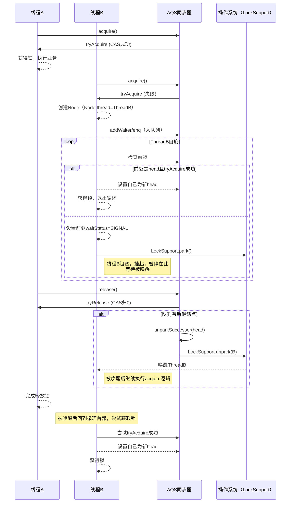

# AQS
AbstractQueuedSynchronizer。AQS是一个用来构建锁和同步器的框架，使用AQS能简单且高效地构造出应用广泛的大量的同步器，比如我们提到的ReentrantLock，Semaphore，其他的诸如ReentrantReadWriteLock，SynchronousQueue，FutureTask等等皆是基于AQS的。当然，我们自己也能利用AQS非常轻松容易地构造出符合我们自己需求的同步器。

## 核心思想
AQS核心思想是，如果被请求的共享资源空闲，则将当前请求资源的线程设置为有效的工作线程，并且将共享资源设置为锁定状态。如果被请求的共享资源被占用，那么就需要一套线程阻塞等待以及被唤醒时锁分配的机制，这个机制AQS是用CLH队列锁实现的，即将暂时获取不到锁的线程加入到队列中。

### CLH队列锁
> CLH(Craig,Landin,and Hagersten)队列是一个虚拟的双向队列(虚拟的双向队列即不存在队列实例，仅存在结点之间的关联关系)。AQS是将每条请求共享资源的线程封装成一个CLH锁队列的一个结点(Node)来实现锁的分配。

CLH（Craig, Landin, and Hagersten）队列锁是一种高性能、自旋式的、基于链表的公平锁，在多核并发环境下常用于构建可伸缩、高吞吐的锁组件。
#### CLH核心思想
CLH队列锁是一种基于队列的自旋锁（Queue-based Spin Lock），采用“链表排队+本地自旋”策略。每个尝试获取锁的线程会按顺序在队列（链表）尾部排队，自旋观察其前驱节点的状态，自旋结束后才能获得锁。

主要目标：
- 公平性：锁的获取严格按照入队顺序进行，先来先服务。
- 减少总线开销：只自旋在自己的前驱节点，避免竞争“全局变量”，大大降低缓存一致性流量。
- 高并发可伸缩：适合多CPU/多核环境，性能随核数上升而可扩展。

#### CLH基本结构

