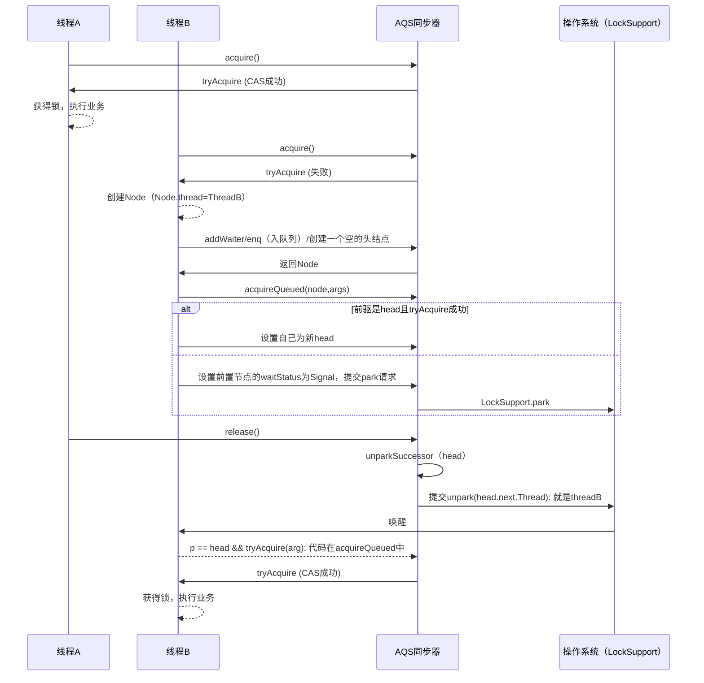
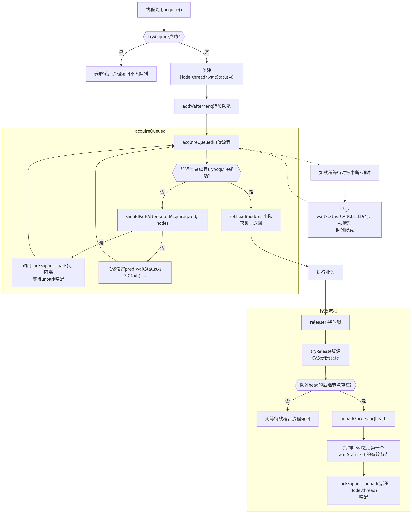

# AQS
AbstractQueuedSynchronizer。AQS是一个用来构建锁和同步器的框架，使用AQS能简单且高效地构造出应用广泛的大量的同步器，比如我们提到的ReentrantLock，Semaphore，其他的诸如ReentrantReadWriteLock，SynchronousQueue，FutureTask等等皆是基于AQS的。当然，我们自己也能利用AQS非常轻松容易地构造出符合我们自己需求的同步器。

## 核心思想
AQS核心思想是，如果被请求的共享资源空闲，则将当前请求资源的线程设置为有效的工作线程，并且将共享资源设置为锁定状态。如果被请求的共享资源被占用，那么就需要一套线程阻塞等待以及被唤醒时锁分配的机制，这个机制AQS是用CLH队列锁实现的，即将暂时获取不到锁的线程加入到队列中。



流程图



```text
graph TB
    A["线程调用acquire()"] --> B{{"tryAcquire成功?"}}
    B -- "是" --> C["获取锁，流程返回不入队列"]
    B -- "否" --> D["创建Node.thread/waitStatus=0"]
    D --> E["addWaiter/enq追加队尾"]
    E --> F["acquireQueued自旋流程"]
    
    subgraph acquireQueued
        F --> F1{{"前驱为head且tryAcquire成功?"}}
        F1 -- "是" --> G["setHead(node)，出队<br>获锁，返回"]
        F1 -- "否" --> H["shouldParkAfterFailedAcquire(pred, node)"]
        H -- "是" --> I["调用LockSupport.park()，阻塞<br>等待unpark唤醒"]
        I --> F
        H -- "否" --> J["CAS设置pred.waitStatus为SIGNAL(-1)"]
        J --> F
    end

    G --> K["执行业务"]
    K --> L["release()释放锁"]

    subgraph "释放流程"
        L --> M["tryRelease资源<br>CAS更新state"]
        M --> N{{"队列head的后继节点存在?"}}
        N -- "否" --> O["无等待线程，流程返回"]
        N -- "是" --> P["unparkSuccessor(head)"]
        P --> Q["找到head之后第一个waitStatus<=0的有效节点"]
        Q --> R["LockSupport.unpark(后继Node.thread)<br>唤醒"]
    end

    F -.-> S["如线程等待时被中断/超时"]
    S -.-> T["节点waitStatus=CANCELLED(1)，被清理<br>队列修复"]
    T -.-> F
```

- 线程A：先调用 acquire，直接CAS获取锁成功。
- 线程B：
    - acquire失败，自行包装为Node加入队尾。
    - 进入acquireQueued循环。不是head.next或tryAcquire失败时，设置SIGNAL并调用park，阻塞于该处（Note显示“线程B阻塞/暂停”）。
    - 只有线程A释放锁后，调用unpark(B)唤醒线程B，B才会从阻塞点继续流程。
    - B被唤醒后流程回到循环开头，再次尝试获取锁，若已经是head的直接后继且tryAcquire成功，则成为新head并获得锁。
- 队列只有B加锁失败会挂入，A直接获得锁不入队。

### CLH队列锁
> CLH(Craig,Landin,and Hagersten)队列是一个虚拟的双向队列(虚拟的双向队列即不存在队列实例，仅存在结点之间的关联关系)。AQS是将每条请求共享资源的线程封装成一个CLH锁队列的一个结点(Node)来实现锁的分配。

CLH（Craig, Landin, and Hagersten）队列锁是一种高性能、自旋式的、基于链表的公平锁，在多核并发环境下常用于构建可伸缩、高吞吐的锁组件。
#### CLH核心思想
CLH队列锁是一种基于队列的自旋锁（Queue-based Spin Lock），采用“链表排队+本地自旋”策略。每个尝试获取锁的线程会按顺序在队列（链表）尾部排队，自旋观察其前驱节点的状态，自旋结束后才能获得锁。

主要目标：
- 公平性：锁的获取严格按照入队顺序进行，先来先服务。
- 减少总线开销：只自旋在自己的前驱节点，避免竞争“全局变量”，大大降低缓存一致性流量。
- 高并发可伸缩：适合多CPU/多核环境，性能随核数上升而可扩展。

#### 节点waitStatus状态流转说明

以独占锁为例，配合状态码说明实际意义。


##### 1. 节点状态(waitStatus)取值

```java
static final int CANCELLED =  1;   // 节点取消，不再参与同步
static final int SIGNAL    = -1;  // 前驱释放时需唤醒本节点
static final int CONDITION = -2;  // 节点在Condition队列中
static final int PROPAGATE = -3;  // 共享模式传播用
// 0（默认值）：新加入Sync队列且还未SIGNALED的正常节点
```

##### 2. 流程图和状态流转
###### 新节点入队

1. 线程加锁失败，创建Node（waitStatus=0，thread=当前线程）
2. 通过addWaiter/enq方法，Node插入Sync队列尾部。

###### 等待与阻塞

3. 在acquireQueued循环中：
    - 如果自己的前驱不是head或还没抢到锁，调用`shouldParkAfterFailedAcquire`
    - **此时前驱的waitStatus会被设置为SIGNAL（-1）**，表示“当我释放锁时要唤醒下一个”
    - 当前节点阻塞自己 `LockSupport.park()`

4. 被前驱unpark唤醒后，继续竞争锁

###### 获得锁

5. 只有head节点的直接后继，且tryAcquire成功，才会：
    - setHead(node)，自己Node升格为新的head（并回收前一个哨兵节点）

###### 取消与异常

6. 如果等待过程中线程被中断或超时，会把自己的waitStatus设为CANCELLED（1），链路后续会跳过已取消节点。
    - 节点及其前后指针被修正，保证Sync queue删除无效节点。
    - 取消逻辑保证不会破坏队列完整性。


###### 时序（流转）示意  
配合每步的waitStatus标记：

| 阶段                  | 对应waitStatus              |
|----------------------|----------------------------|
| 新节点刚入队         | 0（默认）                   |
| 前驱节点设置为SIGNAL | pred.waitStatus = -1       |
| 开始等待被唤醒       | pred.waitStatus = -1，本节点阻塞 |
| 前驱释放锁           | pred.tryRelease，unpark后继 |
| 获得锁，成新head     | waitStatus = 0，Node入head位置 |
| 取消排队             | waitStatus = 1，节点要被清理  |

（说明：只有前驱节点会被设置为SIGNAL! 这样前驱释放锁时负责唤醒其后继。）


###### 伪流程&状态标记举例

假设队列有 head -> Node1 -> Node2：

- Node2刚加进来:  waitStatus=0  
- Node1入队后，head的waitStatus会被设为SIGNAL
- Node2自旋时发现还不能获取锁，Node1的waitStatus设为SIGNAL
- Node1释放时unpark(Node2.thread)
- Node2被唤醒、tryAcquire成功升为新head


###### 概念梳理

- **0**：节点活跃，等待正常
- **SIGNAL(-1)**：释放锁时负责唤醒后继节点
- **CANCELLED(1)**：此节点已退出排队
- **CONDITION(-2)**：节点在Condition队列中（不是Sync队列）
- **PROPAGATE(-3)**：仅在共享锁传播时用


###### 流转全链路总结

1. **新节点waitStatus=0** -> 
2. **它的前驱设置为SIGNAL**（表示后继等我唤醒） ->
3. **如果超时/中断，将自身变为CANCELLED** ->
4. **被唤醒试图变为head** ->
5. **成为新head，等待下一个节点来排队**

