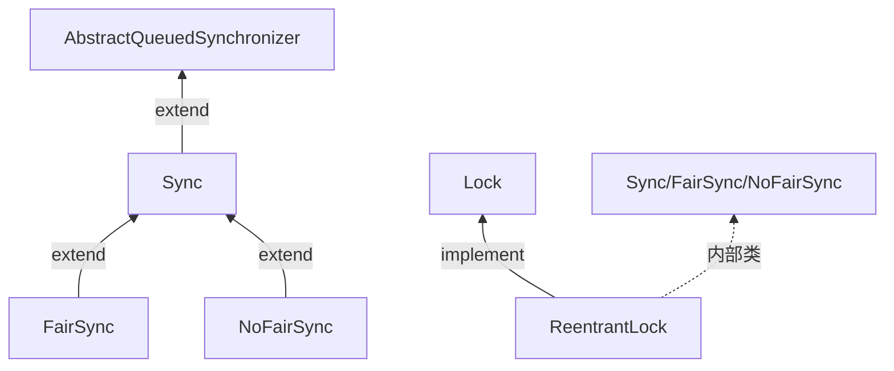
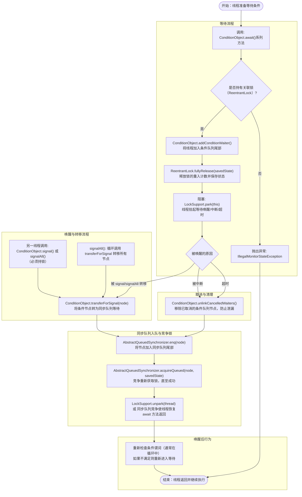
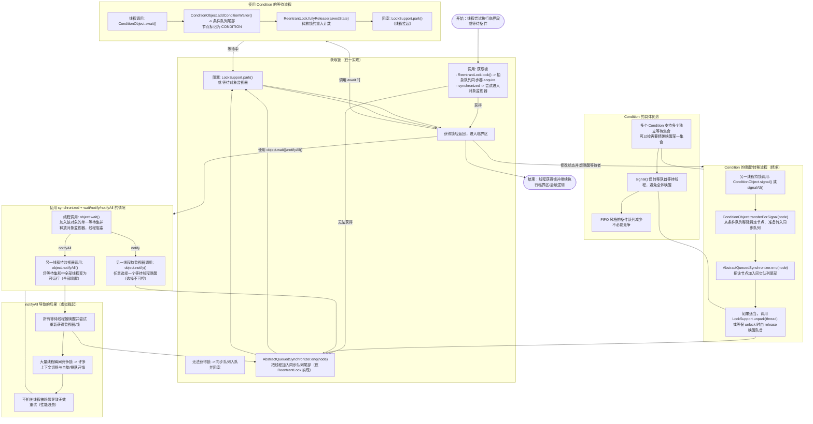
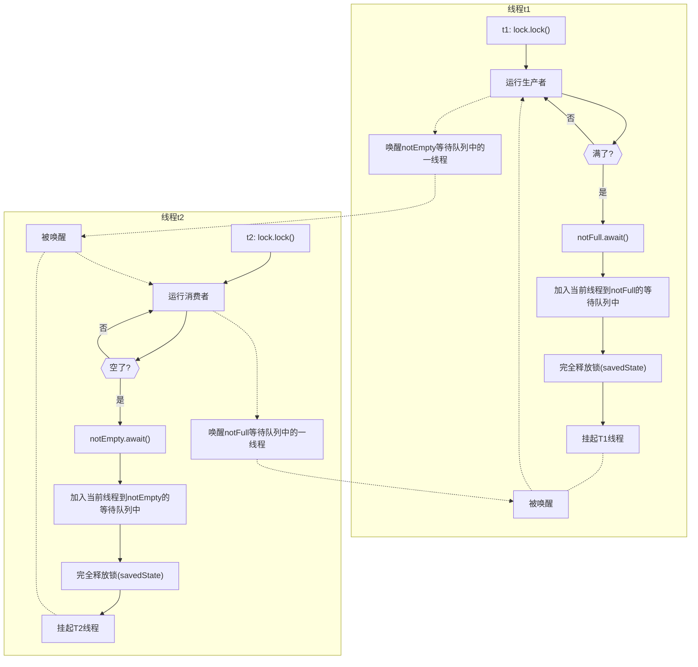

# ReentrantLock
类关系



## AbstractQueuedSynchronizer
```java
/**
 * Queries whether any threads are waiting to acquire. Note that
 * because cancellations due to interrupts and timeouts may occur
 * at any time, a {@code true} return does not guarantee that any
 * other thread will ever acquire.
 *
 * @return {@code true} if there may be other threads waiting to acquire
 */
public final boolean hasQueuedThreads() {
    for (Node p = tail, h = head; p != h && p != null; p = p.prev)
        if (p.status >= 0)
            return true;
    return false;
}
```

## ReentrantLock

```java
final void lock() {
    if (!initialTryLock())
        acquire(1);
}
...
/**
 * Returns a {@link Condition} instance for use with this
 * {@link Lock} instance.
 *
 * <p>The returned {@link Condition} instance supports the same
 * usages as do the {@link Object} monitor methods ({@link
 * Object#wait() wait}, {@link Object#notify notify}, and {@link
 * Object#notifyAll notifyAll}) when used with the built-in
 * monitor lock.
 *
 * <ul>
 *
 * <li>If this lock is not held when any of the {@link Condition}
 * {@linkplain Condition#await() waiting} or {@linkplain
 * Condition#signal signalling} methods are called, then an {@link
 * IllegalMonitorStateException} is thrown.
 *
 * <li>When the condition {@linkplain Condition#await() waiting}
 * methods are called the lock is released and, before they
 * return, the lock is reacquired and the lock hold count restored
 * to what it was when the method was called.
 *
 * <li>If a thread is {@linkplain Thread#interrupt interrupted}
 * while waiting then the wait will terminate, an {@link
 * InterruptedException} will be thrown, and the thread's
 * interrupted status will be cleared.
 *
 * <li>Waiting threads are signalled in FIFO order.
 *
 * <li>The ordering of lock reacquisition for threads returning
 * from waiting methods is the same as for threads initially
 * acquiring the lock, which is in the default case not specified,
 * but for <em>fair</em> locks favors those threads that have been
 * waiting the longest.
 *
 * </ul>
 *
 * @return the Condition object
 */
public Condition newCondition() {
    return sync.newCondition();
}
```

## Sync
```java
final ConditionObject newCondition() {
    return new ConditionObject();
}
```

## NoFairSync

```java
final boolean initialTryLock() {
    Thread current = Thread.currentThread();
    // 直接尝试CAS
    if (compareAndSetState(0, 1)) { // first attempt is unguarded
    // 设置当前线程为锁持有线程
        setExclusiveOwnerThread(current);
        return true;
    } else if (getExclusiveOwnerThread() == current) {
        // 重入
        int c = getState() + 1;
        if (c < 0) // overflow
            throw new Error("Maximum lock count exceeded");
        setState(c);
        return true;
    } else
        return false;
}
```
## FairSync

```java
/**
 * Acquires only if reentrant or queue is empty.
 */
final boolean initialTryLock() {
    Thread current = Thread.currentThread();
    int c = getState();
    if (c == 0) {
        // 如果c==0，即没有上锁
        if (!hasQueuedThreads() && compareAndSetState(0, 1)) {
        // 如果没有queuedThreads，且CAS成功
            setExclusiveOwnerThread(current);
            return true;
        }
    } else if (getExclusiveOwnerThread() == current) {
        // 重入
        if (++c < 0) // overflow
            throw new Error("Maximum lock count exceeded");
        setState(c);
        return true;
    }
    return false;
}
```


## ConditionObject
```java
/**
 * Implements interruptible condition wait.
 * <ol>
 * <li>If current thread is interrupted, throw InterruptedException.
 * <li>Save lock state returned by {@link #getState}.
 * <li>Invoke {@link #release} with saved state as argument,
 *     throwing IllegalMonitorStateException if it fails.
 * <li>Block until signalled or interrupted.
 * <li>Reacquire by invoking specialized version of
 *     {@link #acquire} with saved state as argument.
 * <li>If interrupted while blocked in step 4, throw InterruptedException.
 * </ol>
 */
public final void await() throws InterruptedException {
    if (Thread.interrupted())
        throw new InterruptedException();
    // 构建条件节点
    ConditionNode node = new ConditionNode();
    int savedState = enableWait(node);
    LockSupport.setCurrentBlocker(this); // for back-compatibility
    boolean interrupted = false, cancelled = false, rejected = false;
    while (!canReacquire(node)) {
        if (interrupted |= Thread.interrupted()) {
            if (cancelled = (node.getAndUnsetStatus(COND) & COND) != 0)
                break;              // else interrupted after signal
        } else if ((node.status & COND) != 0) {
            try {
                if (rejected)
                    node.block();
                else
                    ForkJoinPool.managedBlock(node);
            } catch (RejectedExecutionException ex) {
                rejected = true;
            } catch (InterruptedException ie) {
                interrupted = true;
            }
        } else
            Thread.onSpinWait();    // awoke while enqueuing
    }
    LockSupport.setCurrentBlocker(null);
    node.clearStatus();
    acquire(node, savedState, false, false, false, 0L);
    if (interrupted) {
        if (cancelled) {
            unlinkCancelledWaiters(node);
            throw new InterruptedException();
        }
        Thread.currentThread().interrupt();
    }
}

```


## 条件队列的流程图



## 对比



- t1: lock.lock() -> 执行 -> 如果满 -> notFull.await()
- await: addConditionWaiter() -> fullyRelease(savedState) -> LockSupport.park()
- t2: lock.lock() -> 获取锁（因为 t1 已释放） -> take() -> notFull.signal()
- signal: transferForSignal(node) -> AbstractQueuedSynchronizer.enq(node)（转入同步队列）
- t2: lock.unlock() -> AQS.release -> unparkSuccessor(head) -> LockSupport.unpark(t1)
- t1: park 返回 -> acquireQueued(node, savedState) -> 重新获得锁 -> await 返回 -> 继续执行 put()