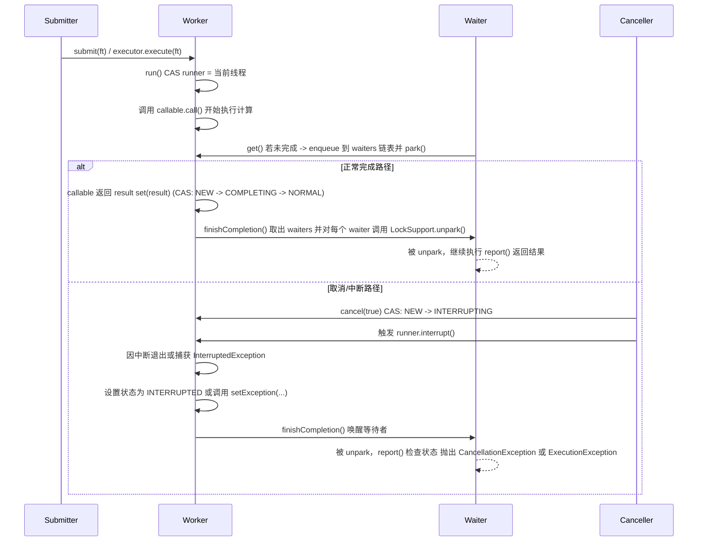
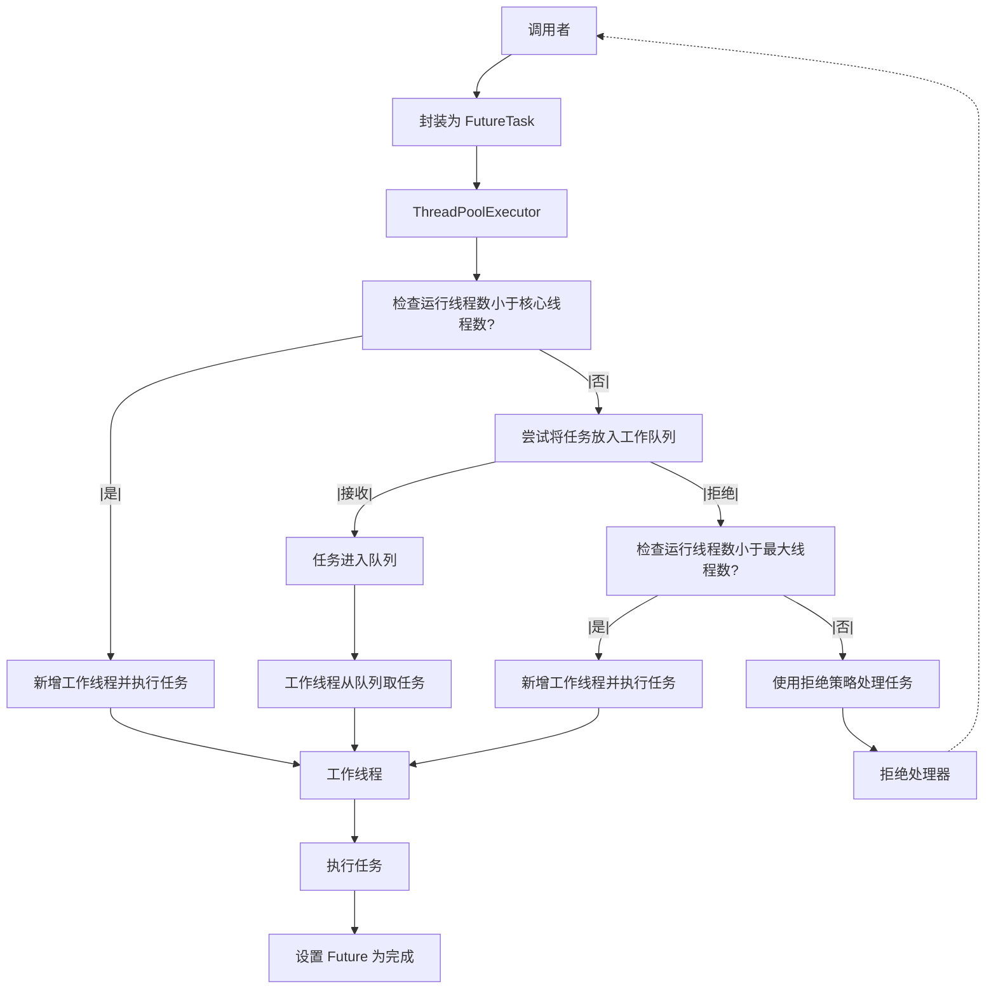
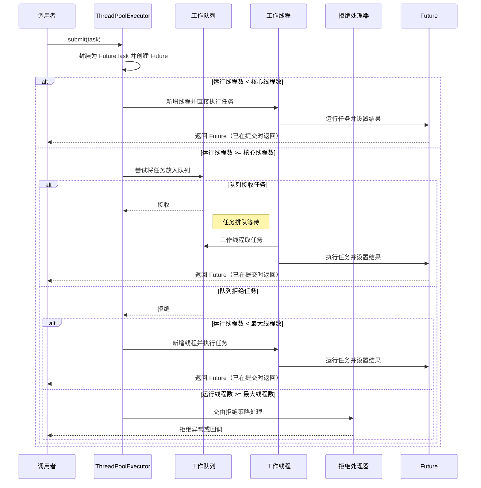
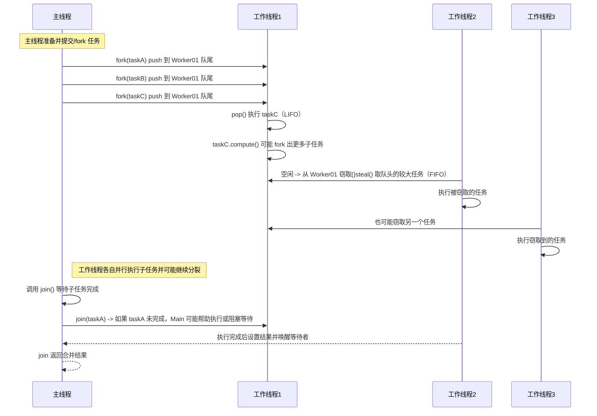

# ThreadPool
## FutureTask
> Future 表示了一个任务的生命周期，是一个可取消的异步运算，可以把它看作是一个异步操作的结果的占位符，它将在未来的某个时刻完成，并提供对其结果的访问。在并发包中许多异步任务类都继承自Future，其中最典型的就是 FutureTask。@pdai

FutureTask 为 Future 提供了基础实现，如获取任务执行结果(get)和取消任务(cancel)等。如果任务尚未完成，获取任务执行结果时将会阻塞。一旦执行结束，任务就不能被重启或取消(除非使用runAndReset执行计算)。FutureTask 常用来封装 Callable 和 Runnable，也可以作为一个任务提交到线程池中执行。除了作为一个独立的类之外，此类也提供了一些功能性函数供我们创建自定义 task 类使用。FutureTask 的线程安全由CAS来保证。
### 图示

时序图说明：

- 提交线程把 FutureTask 提交给线程池（或 new Thread(ft).start()）。
- 执行线程调用 run() 并将 runner 设置为自己，执行 callable.call()。
- 等待线程调用 get()，若任务未完成则加入 waiters 并 park。
- - 执行线程执行结束后调用 set()/setException() -> finishCompletion() -> unpark 等待线程。
- 如果在任务执行过程中有人调用 cancel(true)，会把 state 设为 INTERRUPTING，调用 runner.interrupt()，随后状态变为 INTERRUPTED，finishCompletion() 唤醒等待线程，get() 抛出 CancellationException。




### 核心方法

```java
// 简化的 FutureTask 关键字段与常量（与 OpenJDK 一致的语义）
private volatile int state;            // 任务状态：NEW/COMPLETING/NORMAL/EXCEPTIONAL/CANCELLED/INTERRUPTING/INTERRUPTED
private volatile Thread runner;        // 当前执行任务的线程（仅在运行期间非空）
private Callable<V> callable;          // 实际要执行的任务
private Object outcome;                // 执行结果或异常（正常结果为 V，异常为 Throwable）
private volatile WaitNode waiters;     // 等待队列头，等待 get() 的线程以链表形式挂载

private static final int NEW          = 0;
private static final int COMPLETING   = 1;
private static final int NORMAL       = 2;
private static final int EXCEPTIONAL  = 3;
private static final int CANCELLED    = 4;
private static final int INTERRUPTING = 5;
private static final int INTERRUPTED  = 6;

// 等待节点（用于挂起/唤醒 get() 调用的线程）
static final class WaitNode {
    volatile Thread thread;   // 指向等待的线程
    volatile WaitNode next;   // 链表指针
    WaitNode() { thread = Thread.currentThread(); }
}
...
// 只会被执行一次
public void run() {
    // 只有当 state 为 NEW，并且能够把 runner 从 null 原子设置为当前线程，才继续执行。
    // 这保证只有第一个成功进入的线程能执行任务体。
    if (state != NEW || !UNSAFE.compareAndSwapObject(this, runnerOffset, null, Thread.currentThread()))
        return; // 如果任务已经开始或已被其它线程设置 runner，则直接返回，不重复执行

    try {
        Callable<V> c = callable;        // 读取要执行的 Callable 引用
        if (c != null && state == NEW) {
            V result;
            boolean ran = false;
            try {
                // 执行用户提供的计算逻辑，可能抛出异常
                result = c.call();
                ran = true;
            } catch (Throwable ex) {
                // 如果用户任务抛出异常，将异常保存并设置为异常完成状态
                setException(ex);
                return;
            }
            // 如果正常运行完毕，保存结果并标记为正常完成
            if (ran)
                set(result);
        }
    } finally {
        // 运行结束后，一定要清除 runner 引用以便 GC，并处理可能的中断清理
        runner = null;

        // 如果在跑步过程中曾处于正在中断的过渡状态（INTERRUPTING），
        // 需要等待中断完成或执行额外处理；这里为与 JDK 行为保持一致的占位逻辑。
        int s = state;
        if (s >= INTERRUPTING)
            handlePossibleCancellationInterrupt(s);
    }
}
...

// get() 的核心：检测中断、快速路径检查状态、以及必要时阻塞等待
public V get() throws InterruptedException, ExecutionException {
    // 首先响应当前线程中断状态
    if (Thread.interrupted())
        throw new InterruptedException();

    int s = state;
    // 如果任务尚未完成（state <= COMPLETING），就进入等待逻辑
    if (s <= COMPLETING)
        s = awaitDone(false, 0L); // 非限时等待
    // 根据最终状态返回结果或抛出相应异常
    return report(s);
}

// 等待完成的内部实现：将调用线程加入等待链表并 park，完成时会被 unpark 唤醒
private int awaitDone(boolean timed, long nanos) throws InterruptedException {
    final long deadline = timed ? System.nanoTime() + nanos : 0L;
    WaitNode q = null;
    boolean queued = false;
    for (;;) {
        // 响应中断：如果在等待过程中当前线程被中断，要移除自己的等待节点并抛出 InterruptedException
        if (Thread.interrupted()) {
            removeWaiter(q);
            throw new InterruptedException();
        }

        int s = state;
        // 任务已进入完成相关状态（NORMAL/EXCEPTIONAL/CANCELLED/...），直接返回状态
        if (s > COMPLETING) {
            if (q != null)
                q.thread = null; // 帮助 GC：释放对线程的引用
            return s;
        } else if (s == COMPLETING) {
            // 如果处于短暂的 COMPLETING 过渡状态，主动让出 CPU，等待完成状态定格
            Thread.yield();
        } else if (q == null) {
            // 首次创建等待节点，并设置其 thread 字段为当前线程
            q = new WaitNode();
        } else if (!queued) {
            // 尝试把自己原子地推入 waiters 链表头（LIFO）
            q.next = waiters;
            if (UNSAFE.compareAndSwapObject(this, waitersOffset, q.next, q))
                queued = true;
        } else {
            // 已经入队：调用 park 挂起，等待 finishCompletion 时 unpark
            if (timed) {
                long nanosLeft = deadline - System.nanoTime();
                if (nanosLeft <= 0L) {
                    removeWaiter(q);
                    return state;
                }
                LockSupport.parkNanos(this, nanosLeft);
            } else {
                LockSupport.park(this);
            }
        }
    }
}

// 从等待链表中移除节点（用于中断或超时时清理）
private void removeWaiter(WaitNode node) {
    if (node == null)
        return;
    node.thread = null;
    retry:
    for (;;) {
        // 遍历链表，跳过已经被置 null 的线程引用，最终把链表压缩并原子替换
        WaitNode pred = null;
        for (WaitNode q = waiters; q != null; q = q.next) {
            WaitNode next = q.next;
            if (q.thread != null) {
                pred = q;
                continue;
            }
            if (pred != null) {
                pred.next = next;
                if (pred.thread == null)
                    continue retry;
            } else if (!UNSAFE.compareAndSwapObject(this, waitersOffset, q, next))
                continue retry;
        }
        break;
    }
}

...
public boolean cancel(boolean mayInterruptIfRunning) {
    // 只有状态为 NEW 才能从 NEW 原子转换为 CANCELLED 或 INTERRUPTING
    if (!(state == NEW &&
          UNSAFE.compareAndSwapInt(this, stateOffset, NEW,
              mayInterruptIfRunning ? INTERRUPTING : CANCELLED)))
        return false; // 如果已经开始或已完成，则不能取消，返回 false

    // 如果请求在运行时中断，尝试取得当前 runner 并对其进行中断
    if (mayInterruptIfRunning) {
        try {
            Thread t = runner;
            if (t != null)
                t.interrupt(); // 触发对运行线程的中断请求
        } finally {
            // 将过渡状态 INTERRUPTING -> INTERRUPTED，标记取消已完成
            UNSAFE.compareAndSwapInt(this, stateOffset, INTERRUPTING, INTERRUPTED);
        }
    }

    // 完成取消后的收尾工作：唤醒所有等待的线程并调用 done() 钩子
    finishCompletion();
    return true;
}
...


protected void set(V v) {
    // 只有当 state 为 NEW 时，才能把它先设为 COMPLETING（过渡），随后写结果并置为 NORMAL
    if (UNSAFE.compareAndSwapInt(this, stateOffset, NEW, COMPLETING)) {
        outcome = v; // 保存结果
        // 使用有序写（putOrderedInt）将状态从 COMPLETING 更新为 NORMAL，保证对其它线程的可见性
        UNSAFE.putOrderedInt(this, stateOffset, NORMAL);
        finishCompletion(); // 唤醒等待者，释放 callable 等资源
    }
}

protected void setException(Throwable t) {
    // 与 set 相似，但是保存的是异常并把状态置为 EXCEPTIONAL
    if (UNSAFE.compareAndSwapInt(this, stateOffset, NEW, COMPLETING)) {
        outcome = t; // 保存异常对象
        UNSAFE.putOrderedInt(this, stateOffset, EXCEPTIONAL);
        finishCompletion();
    }
}
....

private void finishCompletion() {
    // 反复尝试把 waiters 链表取出并清空，随后对链表中每个节点调用 unpark
    for (WaitNode q; (q = waiters) != null; ) {
        if (UNSAFE.compareAndSwapObject(this, waitersOffset, q, null)) {
            for (; q != null; q = q.next) {
                Thread t = q.thread;
                if (t != null) {
                    q.thread = null; // 断开引用以利 GC
                    LockSupport.unpark(t); // 唤醒等待的线程
                }
            }
            break;
        }
    }

    // 可被子类重写：任务完成后的钩子（默认空实现）
    done();

    // 帮助回收：丢掉对 callable 的引用，允许闭包捕获的对象被回收
    callable = null;
}

....
private V report(int s) throws ExecutionException {
    Object x = outcome;
    if (s == NORMAL)
        return (V) x; // 正常返回结果
    if (s >= CANCELLED)
        throw new CancellationException(); // 被取消，抛出取消异常
    // 异常完成，抛出 ExecutionException 包装原始异常
    throw new ExecutionException((Throwable) x);
}
```

- 通过 CAS（compare-and-swap）保证对 state、runner、waiters 等字段的原子更新，避免使用重量级锁。
- 等待者以链表形式挂载（LIFO），通过 LockSupport.park/unpark 实现阻塞与唤醒。
- run() 通过先把 runner 设置为当前线程来保证“只执行一次”的语义；其它线程再次调用 run() 会因无法成功设置 runner 而直接返回。
- cancel(true) 使用过渡状态 INTERRUPTING，确保在调用 interrupt 后最终把状态设置为 INTERRUPTED，从而避免竞争导致的可见性问题。
- finishCompletion() 在最终状态确定后负责唤醒所有阻塞在 get() 的线程，并清理引用与调用 done() 钩子。

## ThreadPoolExecutor
> 提供实现和管理线程池的工具包

其实java线程池的实现原理很简单，说白了就是一个线程集合workerSet和一个阻塞队列workQueue。当用户向线程池提交一个任务(也就是线程)时，线程池会先将任务放入workQueue中。workerSet中的线程会不断的从workQueue中获取线程然后执行。当workQueue中没有任务的时候，worker就会阻塞，直到队列中有任务了就取出来继续执行。

## Execute原理
- 把工作单元与执行机制分离开来，工作单元包括Runnable和Callable，而执行机制由Executor框架提供





### 核心参数
- corePoolSize 线程池中的核心线程数，当提交一个任务时，线程池创建一个新线程执行任务，直到当前线程数等于corePoolSize, 即使有其他空闲线程能够执行新来的任务, 也会继续创建线程；如果当前线程数为corePoolSize，继续提交的任务被保存到阻塞队列中，等待被执行；如果执行了线程池的prestartAllCoreThreads()方法，线程池会提前创建并启动所有核心线程。
- workQueue 用来保存等待被执行的任务的阻塞队列. 在JDK中提供了如下阻塞队列: 具体可以参考JUC 集合: BlockQueue详解
    - ArrayBlockingQueue: 基于数组结构的有界阻塞队列，按FIFO排序任务；
    - LinkedBlockingQueue: 基于链表结构的阻塞队列，按FIFO排序任务，吞吐量通常要高于ArrayBlockingQueue；
    - SynchronousQueue: 一个不存储元素的阻塞队列，每个插入操作必须等到另一个线程调用移除操作，否则插入操作一直处于阻塞状态，吞吐量通常要高于LinkedBlockingQueue；
    - PriorityBlockingQueue: 具有优先级的无界阻塞队列；
    - LinkedBlockingQueue比ArrayBlockingQueue在插入删除节点性能方面更优，但是二者在put(), take()任务的时均需要加锁，SynchronousQueue使用无锁算法，根据节点的状态判断执行，而不需要用到锁，其核心是Transfer.transfer().
- maximumPoolSize 线程池中允许的最大线程数。如果当前阻塞队列满了，且继续提交任务，则创建新的线程执行任务，前提是当前线程数小于maximumPoolSize；当阻塞队列是无界队列, 则maximumPoolSize则不起作用, 因为无法提交至核心线程池的线程会一直持续地放入workQueue.
- keepAliveTime 线程空闲时的存活时间，即当线程没有任务执行时，该线程继续存活的时间；默认情况下，该参数只在线程数大于corePoolSize时才有用, 超过这个时间的空闲线程将被终止；
- unit keepAliveTime的单位
- threadFactory 创建线程的工厂，通过自定义的线程工厂可以给每个新建的线程设置一个具有识别度的线程名。默认为DefaultThreadFactory
- handler 线程池的饱和策略，当阻塞队列满了，且没有空闲的工作线程，如果继续提交任务，必须采取一种策略处理该任务，线程池提供了4种策略:
    - AbortPolicy: 直接抛出异常，默认策略；
    - CallerRunsPolicy: 用调用者所在的线程来执行任务；
    - DiscardOldestPolicy: 丢弃阻塞队列中靠最前的任务，并执行当前任务；
    - DiscardPolicy: 直接丢弃任务；
    - 当然也可以根据应用场景实现RejectedExecutionHandler接口，自定义饱和策略，如记录日志或持久化存储不能处理的任务。

## ScheduledThreadPoolExecutor

## ForkJoinPool
### 图示
