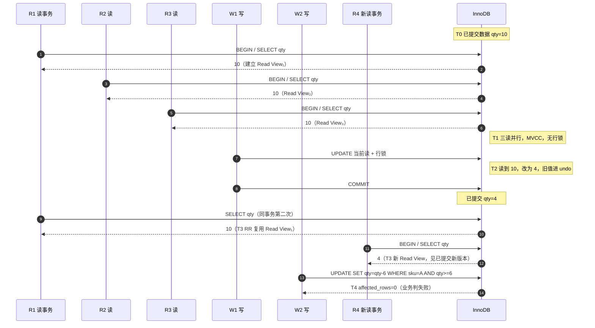
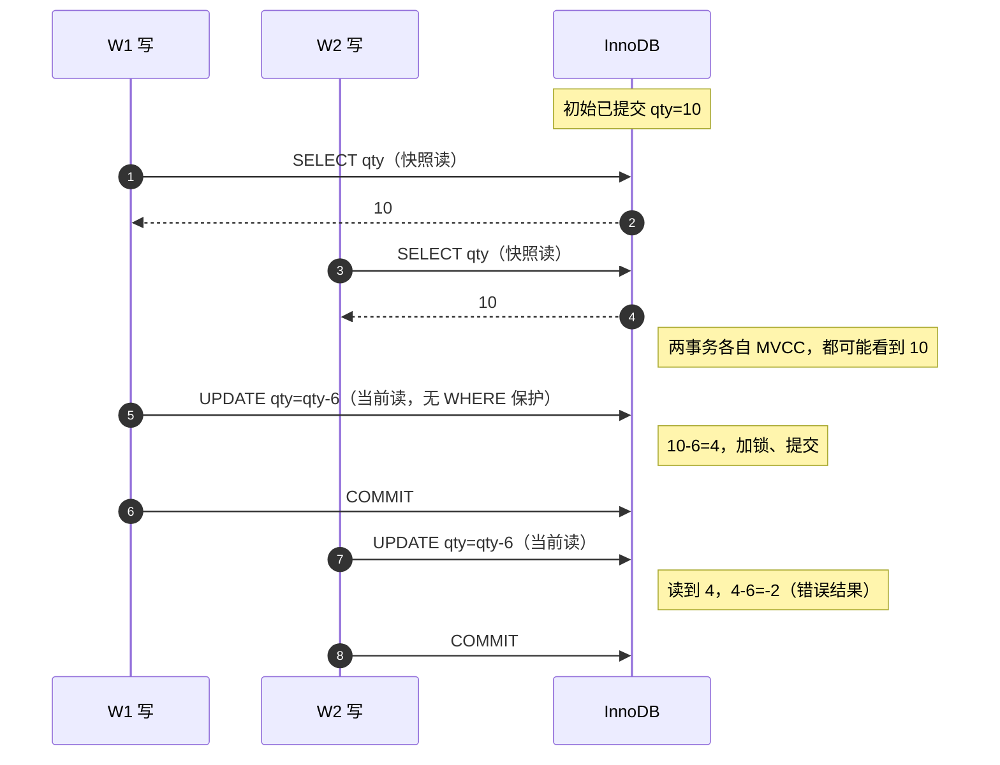

# MySQL（Java Web 进阶）

面向服务端开发：把 MySQL 当作「共享状态 + 持久化介质」来理解，很多问题本质是 **多线程/多进程并发访问同一数据** 与 **磁盘/网络 I/O 延迟** 在数据库内部的折中。

---

## 1. 架构分层与 I/O 视角

- **SQL 层**：解析、优化、权限；偏 CPU 与少量内存访问。
- **存储引擎层（以 InnoDB 为主）**：真正的行存、索引、事务、锁；与 **页（Page，通常 16KB）** 为单位的缓冲池（Buffer Pool）打交道。
- **操作系统与磁盘**：InnoDB 通过 `read()`/`write()`、`mmap`（部分场景）、`fsync`/`fdatasync` 等系统调用把页落到块设备；**顺序写** 远快于 **随机写**（机械盘尤其明显；SSD 仍有写放大与延迟差异）。

**底层直觉**：数据库不是「按行直接从磁盘读」，而是 **按页缓存**；一次查询若索引设计差，会触发大量 **随机页读**（IOPS 瓶颈），比 **顺序扫描少量页** 更伤性能。

---

## 2. InnoDB 缓冲池（Buffer Pool）与内存层次

- Buffer Pool 是 **InnoDB 在用户态管理的一块大页缓存**，对应 CPU 外的 **DRAM**；未命中时从磁盘装入页，命中则避免磁盘 I/O。
- **LRU 变种** 决定页淘汰：热数据保留在内存，冷数据被逐出；与操作系统页缓存可能 **双重缓存**（MySQL 8 可调 `innodb_buffer_pool_in_core_file` 等，但核心仍是「谁占内存」的问题）。

**和 Java Web 的关系**：应用堆外还有一大块 MySQL 进程内存；**连接数 × 每连接缓冲** 与 **InnoDB buffer pool** 共同吃满机器内存时，会触发 **swap** 或 OOM，表现为延迟毛刺——这是 **系统级 I/O（换页）** 而非单纯 SQL 慢。

---

## 3. 事务、隔离级别与并发控制

### 3.1 ACID 在实现上的落点

- **原子性（A）**：依赖 **undo log**；回滚时按 undo 链恢复。
- **一致性（C）**：业务约束 + 引擎约束（外键、唯一索引等）共同保证。
- **隔离性（I）**：**MVCC + 锁**；不同隔离级别下「能看到哪个版本、何时加锁」不同。
- **持久性（D）**：**redo log** 的 WAL（先写日志再刷脏页）+ 可选 `sync_binlog`、双 1 配置等。

### 3.2 MVCC（多版本并发控制）

- 每行有 **隐藏的事务 ID、回滚指针**，配合 **undo 版本链**；读请求在可重复读/读已提交下 **读快照**，通常 **不加读锁**，减少读写互斥。
- **底层含义**：用 **多版本数据** 换 **读并发**；代价是 **版本链过长**、purge 跟不上时，空间和 CPU 用于遍历历史版本。
- **实现细节（入门向）**：见文末 **附录 A**。

### 3.3 隔离级别与现象（Java 并发类比）

| 级别 | 脏读 | 不可重复读 | 幻读（InnoDB 实际） |
|------|------|--------------|---------------------|
| 读未提交 | 可能 | 可能 | 可能 |
| 读已提交 | 否 | 可能 | 可能（语义上） |
| 可重复读（默认） | 否 | 否 | InnoDB 下 **间隙锁+next-key** 抑制典型幻读 |
| 串行化 | 否 | 否 | 否 |

**类比**：Java 里 `volatile` 解决可见性、锁解决互斥；数据库用 **隔离级别 + 锁/MVCC** 定义「多个事务并发时的可见性与互斥规则」。应用层仍可能因 **非原子业务**（查后改）出现竞态，需要 **乐观锁版本号** 或 **单条 SQL/显式锁**。

### 3.4 锁：记录锁、间隙锁、Next-Key

- **记录锁**：索引记录上的互斥。
- **间隙锁（Gap）**：锁住索引记录之间的「空隙」，防止别的事务 **插入** 导致范围结果变化。
- **Next-Key**：记录锁 + 间隙锁，可重复读下常见。

**死锁**：与线程死锁类似——多个事务 **以不同顺序** 申请锁，形成等待环；InnoDB 会 **回滚代价较小的一方**。Java 侧应 **按主键/索引固定顺序** 更新、缩短事务、避免无索引更新导致锁升级为大范围。

---

## 4. 索引（B+ 树）与 I/O、CPU

- **聚簇索引**：叶子节点即 **完整行**（InnoDB 主键）；二级索引叶子存 **主键值**，可能需要 **回表**。
- **覆盖索引**：查询字段全在索引里，**避免回表**，减少随机 I/O。
- **最左前缀、选择性、联合索引顺序**：决定扫描 **索引页数量**（越少越好）。

**底层**：B+ 树高通常很小（3～4 层可存海量行），单次查找是 **O(log n) 次页访问**；但若 **无法走索引** 或 **选择性极差**，会退化为大量页扫描——磁盘带宽/IOPS 成为瓶颈。

**与 Java**：ORM 生成的 SQL 要会看 **EXPLAIN**；`LIKE '%x'`、对列函数、隐式类型转换会导致 **索引失效**，本质是 **优化器无法用语义等价的索引范围扫描**。

---

## 5. Redo Log、Binlog 与持久化路径

- **Redo log（物理日志，InnoDB）**：保证 **崩溃恢复**；循环写文件，`innodb_flush_log_at_trx_commit` 控制 **事务提交时日志刷盘策略**（0/1/2），是在 **延迟与持久性** 之间的折中。
- **Binlog（逻辑日志，Server 层）**：主从复制、CDC；`sync_binlog` 控制刷盘频率。

**WAL**：先追加写 **顺序日志**（对磁盘友好），再 **异步刷脏页**；类似写文件时 **先写 journal 再落数据块**，崩溃后 **重放 redo** 恢复已提交事务。

**底层 I/O**：`fsync` 是 **昂贵 syscall**（把 OS 缓冲刷到设备）；高并发短事务下，**组提交（group commit）** 合并刷盘，提高吞吐。

---

## 6. 连接、线程与 Java 连接池

- MySQL **每连接** 对应服务端线程（经典模型）及 **会话级缓冲**；连接过多 → 内存与 **上下文切换** 压力增大。
- **Java 侧**：HikariCP 等连接池复用 TCP 连接，减少 **三次握手、认证、线程分配** 的开销。

**底层**：每个连接是 **文件描述符 + 内核 socket 缓冲 + 服务端线程栈**；瞬时创建 thousands of connections 会打满 **fd 限制** 与 CPU 调度队列。

---

## 7. 主从复制与一致性（简略）

- **异步复制**：主库写完 binlog，从库 **拉取并应用**；存在 **复制延迟**；Java 读从库可能读到 **旧数据**（**最终一致**）。
- **半同步**：至少一个从库确认收到日志再返回，降低丢数据概率，延迟上升。

**CAP 直觉**：网络分区或从库落后时，**强一致读主** 与 **扩展读从** 需要产品在 **延迟、吞吐、一致性** 间选型。

---

## 8. Java Web 常见落点 checklist

- **事务边界**：`@Transactional` 默认往往对应 **单库连接上的事务**；远程调用、发消息应在事务 **提交后**（避免不一致）；长事务持有锁，放大死锁与阻塞。
- **批量写**：单条 INSERT 循环 vs `batch`/`LOAD DATA`：减少 **往返 RTT** 与 **解析成本**（网络 I/O + CPU）。
- **分页**：深分页 `LIMIT offset` 大时，引擎仍可能要 **扫描大量行**；用 **游标/上次 id** 更稳。
- **唯一约束与并发插入**： duplicate key 是 **数据库级互斥**；与 **应用分布式锁** 分工不同。
- **悲观锁**：`SELECT ... FOR UPDATE` 会占 **行锁/间隙锁**，适合短事务；滥用则与 Java `synchronized` 长持锁类似，拖垮吞吐。

---

## 9. 建议掌握的命令与概念

- `EXPLAIN` / `EXPLAIN ANALYZE`（版本支持情况以实际为准）：**访问类型**（const、range、index、ALL）、**rows**、是否 **Using filesort**、**Using temporary**。
- `SHOW ENGINE INNODB STATUS`：锁等待、死锁信息（不同版本界面可能变化）。
- `information_schema` / performance_schema：锁、语句、I/O 统计（排查用）。
- 字符集与排序规则：`utf8mb4`、**collation** 影响比较与索引使用。

---

## 10. 小结：把知识点串到「并发 + I/O + 底层」

- **并发**：隔离级别、MVCC、锁、死锁、事务时长，对应多事务对 **共享行/索引间隙** 的竞态。
- **I/O**：页、缓冲池、索引减少随机读、WAL/redo、binlog 刷盘、连接与网络 RTT。
- **底层**：内存层次（CPU 缓存 → DRAM → 磁盘）、syscall（`read`/`write`/`fsync`）、文件描述符与线程调度，共同决定 **延迟分布与尾延迟**。

进阶阅读方向：InnoDB 源码中的 **buf0buf、lock0lock、trx0trx、btr0cur** 等模块名可帮助把上述概念落到具体实现。

---

## 附录 A：MVCC 在 InnoDB 里是怎么实现的（入门向）

下面只讲 **InnoDB + 普通 SELECT（一致性读）** 这条路径，足够应付日常开发与面试「能说清楚原理」；`SELECT ... FOR UPDATE` 等 **当前读** 会走锁，不在此展开。

### A.1 先建立直觉：为什么不「一把锁读到底」？

如果读一行就要加读锁、写一行加写锁，**读和写会互相挡**，并发一上来延迟就抖。MVCC 的想法很简单：

- **写**：不立刻覆盖旧数据在「逻辑上的可见性」，而是产生 **新版本**，旧版本通过日志还能拼回来。
- **读（默认快照读）**：读的是「**某个时间点上一致**」的数据，往往 **不用加读锁**，所以和写可以 **更大程度并行**。

可以把它想成文档的 **修订历史**：当前页面上是最新内容，但系统里还留着旧稿；不同读者被允许「定格」在不同修订稿上阅读，互不抢同一把锁。

### A.2 一行数据在 InnoDB 里不止你建的列

InnoDB 给每行（聚簇索引记录）额外带了 **隐藏字段**（概念上理解即可）：

| 隐藏字段（示意） | 作用（白话） |
|------------------|--------------|
| **事务 ID（trx_id）** | 最后一次 **改动这行** 的事务编号；用来判断「这版是谁提交的、你能不能看见」。 |
| **回滚指针（roll_ptr）** | 指向 **undo log** 里「再上一版」的位置；顺着指针可以 **往回找旧数据**。 |

没有主键时还会有 **row_id** 等，进阶再记即可。

**入门要点**：磁盘/缓冲池里这一行，可以理解为「**当前版本 + 一条能找回历史的绳子（回滚指针）**」。

### A.3 undo log：旧版本串成一条链

当你 `UPDATE` 或 `DELETE` 时，InnoDB 会把 **修改前的内容**（至少是关键字段）记到 **undo log**，并让当前行的 `roll_ptr` 指向这条 undo。再来一次修改，就在链头再挂一节。

于是对同一业务行，逻辑上存在：

```text
当前行（聚簇索引里的版本） → undo → undo → … → 更旧的 undo
```

读的时候如果发现「当前这一版我不该看见」，就 **顺着 undo 链向前找**，直到找到 **对本次读可见** 的那一版，或确定没有可见版本。

**和并发的关系**：多个事务同时读，可能各自停在链上 **不同深度** 的版本，这就是「多版本」。

### A.4 Read View：这次读「以谁为准」的快照

「对本次读可见」不是随口说的，InnoDB 用 **Read View（读视图）** 描述 **这一刻哪些事务算已提交、哪些还算活跃**。可以把它记成一张 **名单 + 几个边界**（具体字段名不必背死，理解语义即可）：

- **创建读视图时**：记下当前 **活跃事务 ID 列表**（还没提交的事务）。
- 判断某行版本上的 `trx_id` 时，大致会做三类判断（简化说法）：
  - 若这版的事务 **在创建 Read View 之前就提交了** → 通常 **可见**。
  - 若这版的事务 **就是你本事务** → **可见**（自己改的当然能看见）。
  - 若这版的事务 **还在活跃列表里，或晚于视图边界** → **不可见**，要 **沿 undo 链找更旧的版本**。

**入门要点**：Read View 就是 **一致性读** 的「时间眼镜」：戴上它，同一时间点的 SELECT 看到的世界是一致的。

### A.5 读已提交（RC）和可重复读（RR）差在哪？（只讲 MVCC 部分）

两者都会用 MVCC 做普通 SELECT，差别主要在 **Read View 什么时候创建**（入门记法）：

| 隔离级别 | Read View（简化理解） | 对初学者的现象 |
|----------|------------------------|----------------|
| **读已提交** | 语句级：大体上 **每条 SELECT** 可能用 **新的** 快照 | 同一事务里两次读，可能看见 **别的事务新提交** 的数据（不可重复读）。 |
| **可重复读** | 事务级：事务里 **第一次** 需要快照读时建一个视图，之后 **复用** | 同一事务里多次读，**不** 应看见 **别的事务中途新提交** 对已读行的改写（仍要注意 **幻读** 与 **当前读** 另当别论）。 |

所以：**不是 RR 没有 MVCC，而是「快照有效期」更长**，一致性更强。

### A.6 当前读 vs 一致性读（一定要分清）

- **一致性读（快照读）**：普通 `SELECT`，走 MVCC + Read View + undo 链，**默认不加行锁**（在 RC/RR 下）。
- **当前读**：`SELECT ... FOR UPDATE`、`UPDATE`、`DELETE` 等，要读到 **最新已提交**（并加锁），**不** 走上面那套「戴旧眼镜看历史」的逻辑。

**开发上的一句话**：业务里「先查再改」若用普通 SELECT + 应用里判断，可能和别的事务 **撞车**；要么用 **当前读/乐观锁版本号/单条 SQL 条件更新**，不要只靠默认 SELECT 看到的快照。

### A.7 超简时间线例子（帮助脑补）

假设表中一行 `balance = 100`。

1. 事务 A（ID=50）开始，稍后要把余额改成 80。  
2. 事务 B（ID=60）开始，做普通 `SELECT`（一致性读）。

若 B 的 Read View 建立时，A **尚未提交**：B 读到的可能仍是 **100**（沿 undo 或可见性规则看到旧版本），**不会** 读到 A 未提交的 80——这就对应 **避免脏读**。

若隔离级别是 **RC**，B **下一条** SELECT 可能拿到新快照，A 若已提交，B **可能** 看见 80；**RR** 下同一事务内通常仍保持第一次快照下的可见性（对已存在行的重复读）。

（具体边界以官方文档与版本为准；此处重在 **因果顺序**，不要求背数值。）

### A.8 代价与你会在运维上看到的

- **空间**：undo 与历史版本占用，**purge 线程**异步回收；长事务会 **拖长 undo 链**，占空间、拖慢可见性判断。
- **CPU**：每次读可能要 **沿链走几步**；链太长 = 多几次内存访问（相对磁盘仍便宜，但高并发下会积少成多）。

**和 Java 的类比**：像 `CopyOnWrite` 或带版本号的不可变结构——**读快、写要复制/记日志**；数据库在存储引擎里用 undo + 指针链做了类似的事。

### A.9 场景：库存扣减 + 三个读、两个写（把 MVCC 放到一张桌上）

下面用 **同一行库存** 让 **三个并发读**、**两个并发写** 同时上场，看清：**谁在走 MVCC（快照读）**、**谁在走当前读 + 锁**、以及 **为什么「先 SELECT 再扣减」会超卖**。

#### 设定

- 表 `stock(sku PK, qty)`，只有一行：`sku='A'`，**`qty = 10`**（已提交状态）。
- **R1、R2、R3**：三个 Java 线程（或三个请求），各开一个事务，里面执行普通查询：  
  `SELECT qty FROM stock WHERE sku='A'` —— 全是 **一致性读（快照读）**，走 **MVCC**。
- **W1、W2**：两个线程要各扣 **6** 件（业务上两单都想成功就会超卖），典型错误写法是：  
  先 `SELECT qty`，在应用里判断 `qty >= 6`，再 `UPDATE stock SET qty = qty - 6 ...`。

默认隔离级别按 InnoDB 常见的 **可重复读（RR）** 来讲；提到 RC 的地方会单独说一句。

#### 时间线（简化故事）

下面的顺序是 **便于理解** 的编排，真实调度可能交错，但 **机制不变**。**图 1** 对应 T0～T4 的主线；**图 2** 单独刻画「先快照读再更新」导致的超卖风险。

##### 图 1：时序图（RR，三读 + W1 提交 + R1 重复读 vs 新读事务 + W2 条件更新）

图中 **R4** 表示「W1 提交 **之后** 才开启的读事务」，用来和 **R1 同一事务内第二次 SELECT** 对照，避免和早先的 R1～R3 混在一起。



##### 图 2：时序图（两写都先「快照 SELECT」再 UPDATE —— 为何可能超卖）

两笔事务里的 `SELECT` 都是 **一致性读**；若应用根据读到的 `10` 都认为「够扣」，再发 **无库存保护** 的 `UPDATE ... SET qty=qty-6`，第二笔 **当前读** 会在已变成 `4` 的行上再减，出现 **负数库存**（示例；真实系统应靠 `WHERE qty>=6` 或 `FOR UPDATE` 挡住）。



##### 文字步骤（与图 1 对照）

1. **T0**：库里这一行已是 **`qty=10`**，对应聚簇索引里一版数据 +（可能很短的）undo 历史。  
2. **T1**：R1、R2、R3 **几乎同时** 开始事务，并各自第一次执行上面的 `SELECT`。  
   - 每个事务会拿到自己的 **Read View**（RR 下 **整个事务内** 大体复用同一份快照）。  
   - 若此时没有未提交的写，三人通常都读到 **`10`**。  
   - **MVCC 在这里的作用**：三次读 **互不阻塞**，也 **不需要** 给这行加读锁；引擎只是按各自的 Read View，在 **当前版本 + undo 链** 上判断「这版我能不能看见」。  
3. **T2**：W1 的事务里执行 `UPDATE stock SET qty = qty - 6 WHERE sku='A'`。  
   - `UPDATE` 是 **当前读**：要先 **读到最新可锁定的版本**（不是戴着旧 Read View 做业务那种读），并对这行上 **行锁（及可能间隙锁）**。  
   - 假设 W1 读到 `10`，改成 `4`，写回；提交前/提交后，聚簇索引里这一行变成 **新版本**（`trx_id` 变成 W1 的事务号），旧值 `10` 进 **undo 链**。  
4. **T3**：在 W1 **已提交** 之后，R1 若在 **同一事务里再 SELECT 一次**（RR）：  
   - 仍然按 **第一次** 建立的 Read View 判断可见性，**往往仍看到 10**（可重复读：重复读同一行，结果一致）。  
   - 另起一个读事务（**图 1 中的 R4**）在 W1 提交后再 `SELECT`，会建 **新** Read View，**通常看到 4** —— 和 R1 **同时存在** 的「两个世界」正是 **多版本** 的体现。  
5. **T4**：W2 也执行 `UPDATE ... qty = qty - 6`。  
   - 若 W1 已提交，W2 的当前读看到 **`4`**，`4 - 6` 在业务上应失败，正确 SQL 应写成 `WHERE sku='A' AND qty >= 6`，让 **影响行数 = 0** 表示失败。  
   - 若 W2 在 W1 未提交时就开始更新，会 **等在 W1 的行锁上**；这是 **锁串行化写**，不是 MVCC 替写并发。

#### 用一张表对照「谁在用 MVCC」

| 角色 | SQL 类型 | 是否走 MVCC（快照） | 是否典型地加行锁 |
|------|-----------|---------------------|------------------|
| R1/R2/R3 | 普通 `SELECT` | **是**，按 Read View + undo | **否**（默认） |
| W1/W2 | `UPDATE` / `DELETE` / `SELECT ... FOR UPDATE` | **否**（当前读） | **是** |

**一句话**：**多读可以共享「各自快照」**；**写必须撞到同一行上的真实数据与锁**。MVCC **没有** 取消写的互斥，只是让 **普通读少挡写、写少挡读**。

#### 和「三个读、两个写」直接相关的两个坑

1. **三个读都看到 10，不代表两个写「各扣 6 件」都还能成功**  
   读只是 **某个视图下的逻辑画面**；真正能不能扣，要看 **带条件的更新** 或 **当前读加锁** 是否在 **最新已提交数据** 上成功。  
2. **两个写若都走「先普通 SELECT 再 UPDATE」**  
   两个事务里的第一次 SELECT 都可能仍看到 **10**（各自快照或时机问题），应用里都认为「够扣」，然后两个 `UPDATE` 先后执行，就可能 **扣成负数或超卖** —— 见 **图 2**。这是 **业务原子性** 问题，要靠 **`UPDATE ... WHERE qty >= 6`**、`FOR UPDATE`、或 **版本号乐观锁** 解决，**不能**指望 MVCC 替你当库存锁。

#### 若隔离级别是读已提交（RC）

- 同一事务内 **每条** `SELECT` 可能用 **新 Read View**，R1 **第二次** SELECT **更可能** 立刻看到 W1 提交后的 `4`。  
- **MVCC 仍然服务普通读**；库存扣减的正确写法 **仍然** 要按上面方式保证 **写与写的互斥或条件更新**，与 RR/RC 无关。

---

到此，入门可以记住三句话：**隐藏列标版本、undo 串旧版本、Read View 定可见**；再结合 **A.9**，记住 **读看快照、写碰真身 + 锁**，库存类业务要 **在 SQL 层收紧条件**。进阶再扣 **purge、二级索引与主键回表、幻读与间隙锁** 的配合即可。
