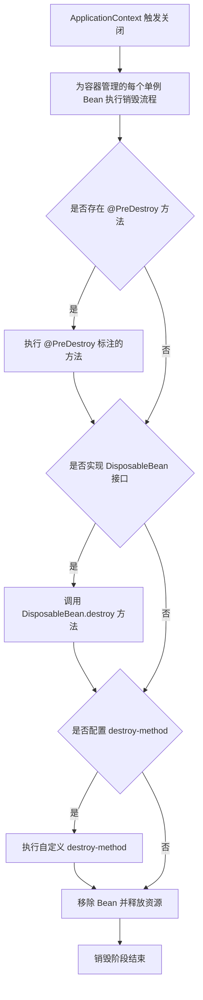
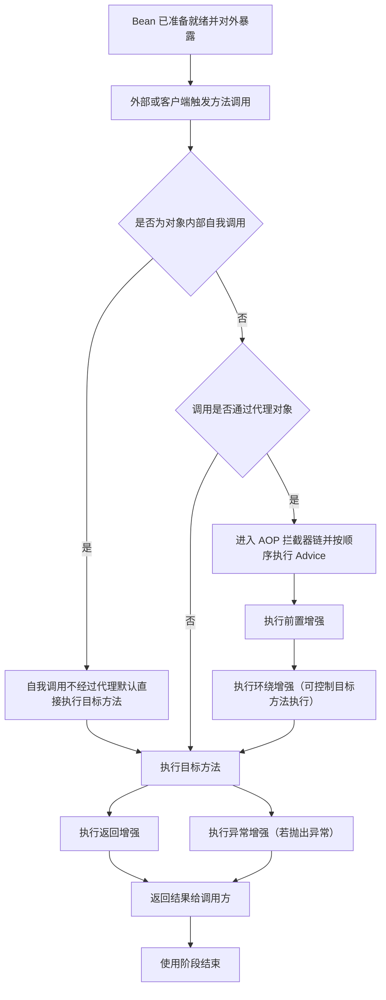

# spring
Spring的一个最大的目的就是使JAVA EE开发更加容易。同时，Spring之所以与Struts、Hibernate等单层框架不同，是因为Spring致力于提供一个以统一的、高效的方式构造整个应用，并且可以将单层框架以最佳的组合揉和在一起建立一个连贯的体系。可以说Spring是一个提供了更完善开发环境的一个框架，可以为POJO(Plain Ordinary Java Object)对象提供企业级的服务。
## Spring的特性和优势
### 特性
- 非侵入式：基于Spring开发的应用中的对象可以不依赖于Spring的API
- 控制反转：IOC——Inversion of Control，指的是将对象的创建权交给 Spring 去创建。使用 Spring 之前，对象的创建都是由我们自己在代码中new创建。而使用 Spring 之后。对象的创建都是给了 Spring 框架。
- 依赖注入：DI——Dependency Injection，是指依赖的对象不需要手动调用 setXX 方法去设置，而是通过配置赋值。
- 面向切面编程：Aspect Oriented Programming——AOP
- 容器：Spring 是一个容器，因为它包含并且管理应用对象的生命周期
- 组件化：Spring 实现了使用简单的组件配置组合成一个复杂的应用。在 Spring 中可以使用XML和Java注解组合这些对象。
- 一站式：在 IOC 和 AOP 的基础上可以整合各种企业应用的开源框架和优秀的第三方类库（实际上 Spring 自身也提供了表现层的 SpringMVC 和持久层的 Spring JDBC）

### 优势
- Spring 可以使开发人员使用 POJOs 开发企业级的应用程序。只使用 POJOs 的好处是你不需要一个 EJB 容器产品，比如一个应用程序服务器，但是你可以选择使用一个健壮的 servlet 容器，比如 Tomcat 或者一些商业产品。
- Spring 在一个单元模式中是有组织的。即使包和类的数量非常大，你只要担心你需要的，而其它的就可以忽略了。
- Spring 不会让你白费力气做重复工作，它真正的利用了一些现有的技术，像 ORM 框架、日志框架、JEE、Quartz 和 JDK 计时器，其他视图技术。
- 测试一个用 Spring 编写的应用程序很容易，因为环境相关的代码被移动到这个框架中。此外，通过使用 JavaBean-style POJOs，它在使用依赖注入注入测试数据时变得更容易。
- Spring 的 web 框架是一个设计良好的 web MVC 框架，它为比如 Structs 或者其他工程上的或者不怎么受欢迎的 web 框架提供了一个很好的供替代的选择。MVC 模式导致应用程序的不同方面(输入逻辑，业务逻辑和UI逻辑)分离，同时提供这些元素之间的松散耦合。模型-(Model)封装了应用程序数据，通常它们将由 POJO 类组成。视图(View)负责渲染模型数据，一般来说它生成客户端浏览器可以解释 HTML 输出。控制器(Controller)负责处理用户请求并构建适当的模型，并将其传递给视图进行渲染。
- Spring 对 JavaEE 开发中非常难用的一些 API（JDBC、JavaMail、远程调用等），都提供了封装，使这些API应用难度大大降低。
- 轻量级的 IOC 容器往往是轻量级的，例如，特别是当与 EJB 容器相比的时候。这有利于在内存和 CPU 资源有限的计算机上开发和部署应用程序。
- Spring 提供了一致的事务管理接口，可向下扩展到（使用一个单一的数据库，例如）本地事务并扩展到全局事务（例如，使用 JTA）
## Core Container（Spring的核心容器）
Spring 的核心容器是其他模块建立的基础，由 Beans 模块、Core 核心模块、Context 上下文模块和 SpEL 表达式语言模块组成，没有这些核心容器，也不可能有 AOP、Web 等上层的功能。具体介绍如下。
- Beans 模块：提供了框架的基础部分，包括控制反转和依赖注入。
- Core 核心模块：封装了 Spring 框架的底层部分，包括资源访问、类型转换及一些常用工具类。
- Context 上下文模块：建立在 Core 和 Beans 模块的基础之上，集成 Beans 模块功能并添加资源绑定、数据验证、国际化、Java EE 支持、容器生命周期、事件传播等。ApplicationContext 接口是上下文模块的焦点。
- SpEL 模块：提供了强大的表达式语言支持，支持访问和修改属性值，方法调用，支持访问及修改数组、容器和索引器，命名变量，支持算数和逻辑运算，支持从 Spring 容器获取 Bean，它也支持列表投影、选择和一般的列表聚合等。


## 核心流程
### 启动

```mermaid
graph TD
  Start["ApplicationContext 启动并刷新"]
  LoadDefinitions["加载并解析 BeanDefinition"]
  InvokeBFPP["执行 BeanFactoryPostProcessor"]
  RegisterBPP["注册并初始化 BeanPostProcessor 列表"]
  ForEachBean["为单个 Bean 开始创建"]
  BeforeInstDecision{"postProcessBeforeInstantiation 是否返回替代实例"}
  UseShortInstance["使用替代实例并跳过默认实例化与属性注入"]
  ShortPostAfter["对替代实例执行 postProcessAfterInitialization"]
  Instantiate["实例化 Bean（构造器或工厂方法）"]
  AfterInstDecision{"postProcessAfterInstantiation 是否返回 false（跳过属性填充）"}
  SkipPopulate["跳过属性填充"]
  ScopeDecision{"是否为单例作用域"}
  ExposeEarlyFactory["向 singletonFactories 注册 ObjectFactory 以支持早期引用"]
  PopulateProperties["填充属性并处理依赖注入"]
  CheckCircular{"填充过程中是否发现循环依赖"}
  GetEarlyRef["从 earlySingletonObjects 或 singletonFactories 获取早期引用并注入"]
  InvokeAware["回调 Aware 接口方法（如 BeanNameAware）"]
  PostProcessBeforeInit["调用 BeanPostProcessor.postProcessBeforeInitialization"]
  PostConstructCheck{"是否存在 @PostConstruct 方法"}
  PostConstructMethods["执行 @PostConstruct 标注的方法"]
  AfterPropertiesSetCheck{"是否实现 InitializingBean"}
  AfterPropertiesSet["调用 InitializingBean.afterPropertiesSet"]
  CustomInitCheck{"是否配置 init-method"}
  CustomInitMethod["执行自定义 init-method"]
  PostProcessAfterInit["调用 BeanPostProcessor.postProcessAfterInitialization"]
  NeedProxy{"是否匹配切点或 Advisor 需要创建代理"}
  CreateProxy["组装拦截器链并创建代理（JDK 动态代理或 CGLIB）"]
  BeanReady["Bean 准备就绪并对外暴露（代理或者原始对象）"]
  EndCreation["创建阶段完成"]

  Start --> LoadDefinitions --> InvokeBFPP --> RegisterBPP --> ForEachBean
  ForEachBean --> BeforeInstDecision
  BeforeInstDecision -- "是" --> UseShortInstance --> ShortPostAfter --> BeanReady
  BeforeInstDecision -- "否" --> Instantiate
  Instantiate --> AfterInstDecision
  AfterInstDecision -- "是" --> SkipPopulate --> InvokeAware
  AfterInstDecision -- "否" --> ScopeDecision
  ScopeDecision -- "是" --> ExposeEarlyFactory --> PopulateProperties
  ScopeDecision -- "否" --> PopulateProperties
  PopulateProperties --> CheckCircular
  CheckCircular -- "是" --> GetEarlyRef --> PopulateProperties
  CheckCircular -- "否" --> InvokeAware
  InvokeAware --> PostProcessBeforeInit --> PostConstructCheck
  PostConstructCheck -- "是" --> PostConstructMethods --> AfterPropertiesSetCheck
  PostConstructCheck -- "否" --> AfterPropertiesSetCheck
  AfterPropertiesSetCheck -- "是" --> AfterPropertiesSet --> CustomInitCheck
  AfterPropertiesSetCheck -- "否" --> CustomInitCheck
  CustomInitCheck -- "是" --> CustomInitMethod --> PostProcessAfterInit
  CustomInitCheck -- "否" --> PostProcessAfterInit
  PostProcessAfterInit --> NeedProxy
  NeedProxy -- "是" --> CreateProxy --> BeanReady
  NeedProxy -- "否" --> BeanReady
  BeanReady --> EndCreation
```


创建阶段方法/节点作用说明（要点）

- ApplicationContext 启动并刷新：启动容器并触发后续解析与处理流程。
- 加载并解析 BeanDefinition：读取配置类或 XML，生成每个 Bean 的元数据。
- BeanFactoryPostProcessor：在 Bean 实例化前修改 Bean 定义或配置属性。
- 注册 BeanPostProcessor：收集所有后置处理器，供后续实例化生命周期调用。
- postProcessBeforeInstantiation：InstantiationAwareBeanPostProcessor 提供的钩子，可在实例化前短路并返回替代实例（常用于提前创建代理）。
- 实例化（构造器或工厂方法）：真正创建对象实例的阶段。
- postProcessAfterInstantiation：可决定是否继续属性填充；返回 false 时跳过填充。
- 单例早期引用与三级缓存（ExposeEarlyFactory / earlySingletonObjects 等）：为解决单例属性注入的循环依赖而暴露早期引用。
- 属性填充：解析 @Autowired、@Value 等注解并注入依赖。
- Aware 回调：若实现 Aware 接口，容器会注入相关环境并回调接口方法。
- postProcessBeforeInitialization：BeanPostProcessor 的前置方法，常用于准备或包装属性。
- @PostConstruct、afterPropertiesSet、init-method：初始化回调链，按此顺序执行框架和自定义初始化逻辑。
- postProcessAfterInitialization：后置处理器的最后一步，自动代理创建器通常在此判断是否为目标创建代理并返回代理对象。
- 代理创建：根据切点组装拦截器链并选择代理实现，代理将替代原始对象对外暴露。

若觉得上图节点太多，可先翻到文末 **「Spring Bean 初始化流程（易读版补充）」**，看五阶段表和初始化回调顺序。

### 销毁


销毁阶段方法/节点作用说明（要点）

- ApplicationContext 关闭：触发容器级别的销毁流程，通常在应用停止或热重启时发生。
- @PreDestroy：在销毁前执行的注解方法，用于释放资源或注销注册。
- DisposableBean.destroy：实现 DisposableBean 接口的销毁回调，由容器调用。
- 自定义 destroy-method：配置于 Bean 定义的自定义销毁方法，容器在销毁阶段调用。
- 移除并释放资源：容器完成回调后回收引用，关闭连接池等资源，完成 Bean 的销毁。

### 调用


使用阶段方法/节点作用说明（要点）

- Bean 已准备就绪：此时容器对外提供的可能是代理对象或原始对象。
- 自我调用（self-invocation）：对象内部直接调用自身方法通常绕过代理而不触发切面，若需要拦截需通过代理对象调用或获取当前代理。
- 代理检查：方法调用到达时判断是否由代理接管；若是代理对象则进入拦截链。
- 拦截器链：按切面定义顺序执行增强逻辑，包括前置、环绕、返回、异常等增强。
- 环绕增强：可在调用前后执行自定义逻辑并决定是否以及何时调用目标方法。
- 返回与异常增强：在目标方法正常返回或抛出异常后分别执行对应增强逻辑。

---

## Spring Bean 初始化流程（易读版补充）

下面用「先整体、后细节」的方式，和上文 **启动** 小节里的流程图一一对应，降低阅读难度。

### 一句话心智模型

容器做的是三件事：**先收齐图纸（BeanDefinition）并允许改图纸（BFPP）**，再 **按依赖把对象造出来并互相接线（实例化 + 属性注入）**，最后 **做完初始化回调、必要时包一层代理**，Bean 才算真正可用。

### 五个阶段（对应流程图从左到右）

| 阶段 | 在干什么 | 你可以把它想成 |
|------|----------|----------------|
| ① 容器准备 | 刷新上下文、加载 BeanDefinition、执行 `BeanFactoryPostProcessor`、注册 `BeanPostProcessor` | 开工前：定规格、改配置、登记质检员 |
| ② 实例化与「短路」 | `postProcessBeforeInstantiation` 若返回非 null，则用替代实例并跳过后面的默认实例化与注入 | 有人提前塞了一个成品，后面步骤可跳过 |
| ③ 造对象与接线 | 构造器/工厂方法 **实例化** →（单例可注册早期引用）→ **属性填充**、解析 `@Autowired` 等 | 先 new，再 setter/字段注入 |
| ④ 初始化前 | `Aware` 回调 → `postProcessBeforeInitialization` | 告诉 Bean「你在容器里的名字/环境」，BPP 再加工一次 |
| ⑤ 初始化与收尾 | `@PostConstruct` → `InitializingBean.afterPropertiesSet` → `init-method` → `postProcessAfterInitialization` → 按需 **创建代理** | 业务自定义初始化 → 最后 BPP 常在这里 **生成 AOP 代理** |

**记忆口诀（初始化回调顺序）**：  
`BeforeInitialization`（BPP）→ `@PostConstruct` → `InitializingBean` → `init-method` → `AfterInitialization`（BPP，代理多在此返回）。

### 和「循环依赖」「三级缓存」的关系（只记结论）

- **仅单例**、通过 **属性/setter 注入** 的循环依赖，容器会用 **早期暴露的半成品引用** 先完成注入，再走完完整生命周期；**构造器循环依赖** 一般无法靠三级缓存解决，应改设计或换注入方式。
- 流程图中的 `singletonFactories` / `earlySingletonObjects` 等，就是为 **「属性填充时对方还没完全建好」** 时仍能拿到可注入的引用。

### 容易混淆的两点

1. **`BeanFactoryPostProcessor` 与 `BeanPostProcessor`**：前者在 **Bean 实例化之前** 改 **BeanDefinition/配置**；后者在 **每个 Bean 的创建过程中** 前后各插一刀（`before` / `after`）。
2. **`postProcessAfterInitialization` 与代理**：很多 **自动代理** 在 **所有初始化做完之后** 才决定要不要包代理，所以「最终放进容器、被别人 `@Autowired` 的」常常是 **代理对象**，而不是裸的原始类型（除非未走代理）。

### 与「销毁」「调用」两节的衔接

- **初始化**结束得到的是 **就绪 Bean**（可能是代理）。
- **调用**一节描述的是：之后每次业务方法被调用时，是否经过代理、切面如何织入。
- **销毁**是独立的一条线：容器关闭时对单例依次执行 `@PreDestroy` → `DisposableBean` → `destroy-method`，与初始化顺序 **相反方向** 的「收尾」。

---

## 术语中英对照与用途速查

下面按「出现在文档流程里的顺序」归类：先给 **英文含义**，再给 **在 Spring 里干什么 / 典型应用点**。与 `@Bean` 无直接对应关系的，会单独说明。

### 容器与元数据

| 英文 / 接口 | 字面与含义 | 应用点 |
|-------------|------------|--------|
| **ApplicationContext** | Application「应用」+ Context「上下文」→ 应用上下文 | 高级容器：除 Bean 工厂外，还提供国际化、事件、资源加载等；`refresh()` 会驱动整次启动流程。 |
| **BeanDefinition** | Bean「组件」+ Definition「定义」→ Bean 定义 | 描述「类名、作用域、构造参数、属性、init/destroy 方法」等元数据；配置类/XML 解析后先落成 `BeanDefinition`，再按需创建实例。 |
| **refresh** | 刷新 | `ApplicationContext` 启动时重新加载定义、执行 `BeanFactoryPostProcessor`、注册 BPP、预实例化单例等；热启动/测试里也会见到。 |

### 工厂级扩展（改「图纸」，不改「已造好的对象」）

| 英文 / 接口 | 字面与含义 | 应用点 |
|-------------|------------|--------|
| **BeanFactoryPostProcessor**（常缩写 **BFPP**） | 在 BeanFactory 层后置处理 | **在任意 Bean 实例化之前** 修改 `BeanDefinition`（例如改属性占位符、`@Configuration` 增强）。实现接口并注册为 Bean 即可，**不是** `@Bean` 专属注解。 |
| **BeanPostProcessor**（常缩写 **BPP**） | Bean 后置处理器 | **每个 Bean 创建过程中** 介入：`postProcessBeforeInitialization` / `postProcessAfterInitialization`。用于包装、校验、**AOP 代理** 等。需注册为 Spring 管理的 Bean。 |

### 实例化阶段：`InstantiationAwareBeanPostProcessor`

| 方法 / 概念 | 字面与含义 | 应用点 |
|-------------|------------|--------|
| **InstantiationAware** | Instantiation「实例化」+ Aware「可感知」 | 子接口扩展了普通 BPP，多两个与「实例化时机」相关的钩子。 |
| **postProcessBeforeInstantiation** | before「在…之前」+ Instantiation「实例化」 | 在容器用构造器/`@Bean` 方法等 **默认方式创建实例之前** 调用；返回 **非 null** 则 **短路**（跳过默认实例化与属性注入），仍走 `postProcessAfterInitialization`。框架里 **AOP**（如 `AbstractAutoProxyCreator`）可能用它做早期代理；业务代码少用。 |
| **postProcessAfterInstantiation** | after「在…之后」 | 实例已创建、**尚未属性填充** 时调用；若返回 **false** 可 **跳过依赖注入**（慎用，一般用于特殊性能或只读场景）。 |

### 单例与循环依赖（三级缓存相关）

| 英文 | 字面与含义 | 应用点 |
|------|------------|--------|
| **singletonFactories** | singleton「单例」+ factories「工厂集合」 | 单例创建过程中存放 **ObjectFactory**，用于在「属性还没填完」时按需拿到早期引用。 |
| **earlySingletonObjects** | early「早期」+ singleton objects | 存放 **已提前暴露** 的单例半成品，配合循环依赖注入。 |
| **ObjectFactory** | 对象工厂 | `getObject()` 时可能创建或返回早期 Bean，供注入方引用；与 **懒加载/早期暴露** 语义相关。 |

### 属性填充与 Aware

| 英文 / 注解 | 字面与含义 | 应用点 |
|-------------|------------|--------|
| **populate** | 填充 | 容器向 Bean **注入属性**（`@Autowired`、`@Value`、XML property 等）。 |
| **@Autowired** | Auto「自动」+ Wired「接线」 | 按类型/名称自动注入依赖；发生在 populate 阶段。 |
| **@Value** | 值注入 | 注入字面量、`${...}` 占位符、SpEL 表达式结果。 |
| **Aware** | 感知、觉察 | 一组 **回调接口**（如 `BeanNameAware`、`ApplicationContextAware`），让 Bean **拿到容器/名字等环境信息**；在初始化回调链早期执行。 |

### 初始化回调链（顺序重要）

| 英文 / 接口 / 配置 | 字面与含义 | 应用点 |
|--------------------|------------|--------|
| **postProcessBeforeInitialization** | Initialization「初始化」之前 | BPP 在「用户自定义初始化」**之前** 再加工一次 Bean（例如某些校验或包装）。 |
| **@PostConstruct** | Post「在…之后」+ Construct「构造」 | 实为在 **依赖注入完成之后** 执行带注解的无参方法（JSR-250）；常用于 **轻量初始化**（开线程、校验参数）。 |
| **InitializingBean** | Initializing「正在初始化」 | 接口方法 **`afterPropertiesSet()`**：**属性都设好后** 调用；与 XML `init-method`、注解初始化同属「业务初始化」层。 |
| **init-method** | 自定义初始化方法名 | XML/JavaConfig 里配置的 **自定义方法名**；与 `@PostConstruct` / `afterPropertiesSet` 同属一条链，**顺序在文档图中已标**。 |

### 初始化之后与 AOP

| 英文 | 字面与含义 | 应用点 |
|------|------------|--------|
| **postProcessAfterInitialization** | Initialization 之后 | BPP 最后机会；**AnnotationAwareAspectJAutoProxyCreator** 等在此判断是否需要 **代理**，返回代理则容器中暴露的是代理对象。 |
| **Advisor** | 顾问、通知器 | Spring AOP 里把 **切点（Pointcut）+ 通知（Advice）** 绑在一起；代理创建时根据 Advisor 决定是否织入。 |
| **Pointcut / 切点** | 切入点 | 匹配「哪些类的哪些方法」需要增强。 |
| **Advice** | 通知、增强 | 具体拦截逻辑：前置、后置、环绕、异常等。 |
| **JDK 动态代理** | 基于接口的代理 | 目标类 **实现接口** 时常用；通过 `InvocationHandler` 转发。 |
| **CGLIB** | Code Generation Library | **子类代理**；目标无接口或需要代理类本身时常用。 |

### 销毁阶段

| 英文 / 注解 | 字面与含义 | 应用点 |
|-------------|------------|--------|
| **@PreDestroy** | Pre「在…之前」+ Destroy「销毁」 | 容器关闭单例时 **最先** 调用的注解销毁方法（JSR-250）；关连接、注销监听等。 |
| **DisposableBean** | Disposable「可丢弃的」 | 接口 **`destroy()`**；与 `@PreDestroy`、`destroy-method` 同属销毁链。 |
| **destroy-method** | 自定义销毁方法名 | XML/JavaConfig 配置的销毁回调名。 |

### 运行期调用与 AOP

| 英文 | 字面与含义 | 应用点 |
|------|------------|--------|
| **self-invocation** | 自我调用 | 同类内 `this.foo()` **不经过代理**，切面默认不生效；需通过 **注入自身代理** 或 **AopContext** 等绕过。 |
| **Interceptor chain** | Interceptor「拦截器」+ chain「链」 | 代理上方法被调用时，**多个 Advice 按顺序** 形成链条执行。 |
| **BeforeAdvice** | 前置增强 | 目标方法执行 **前** 运行。 |
| **AroundAdvice** | 环绕增强 | 包住目标方法，可 **决定是否/何时** 调用原方法（`ProceedingJoinPoint.proceed()`）。 |
| **AfterReturningAdvice** | 返回后增强 | 正常返回后执行（可拿到返回值）。 |
| **AfterThrowingAdvice** | 抛出后增强 | 抛异常后执行（常用于日志、转换异常）。 |

### 与 `@Bean` 的关系（集中说明）

- **`@Bean`**：写在 `@Configuration`（等）方法上，表示 **「由这个方法负责提供一个 Bean 实例」**，属于 **Bean 定义来源**。
- **`postProcessBeforeInstantiation` 等**：属于 **生命周期扩展点**，通过实现 **`InstantiationAwareBeanPostProcessor` / `BeanPostProcessor`** 并 **注册成容器里的 Bean** 生效，**不是** 在 `@Bean` 上声明的。
- 二者可能 **同时作用于同一个逻辑 Bean**：先经过 BPP 钩子，再走 `@Bean` 方法或构造器创建（除非 `postProcessBeforeInstantiation` 已短路）。

---

## 场景与简单代码示例

下面每个 **场景** 对应上文流程里的一类能力；代码为 **示意**（省略包名、import），重在看清 **写在哪儿、何时执行**。实际项目需按模块与 Spring Boot 版本微调。

### 场景 1：`BeanFactoryPostProcessor` —— 启动阶段改「Bean 定义」

**场景**：所有 Bean 还没实例化，想统一改某个 Bean 的元数据（例如给某个 `BeanDefinition` 多加一个属性值、或注册后处理器前的全局调整）。

```java
@Component
public class DemoBeanFactoryPostProcessor implements BeanFactoryPostProcessor {

    @Override
    public void postProcessBeanFactory(ConfigurableListableBeanFactory beanFactory) {
        if (beanFactory.containsBeanDefinition("reportService")) {
            BeanDefinition bd = beanFactory.getBeanDefinition("reportService");
            bd.getPropertyValues().add("enabled", true); // 对应 ReportService 的 setEnabled
        }
    }
}
```

**要点**：这里操作的是 **`BeanDefinition`**，不是业务实例；执行时机早于 **任何** 该 Bean 的 `new`。

---

### 场景 2：`BeanPostProcessor` —— 每个 Bean 创建前后「包一层」或打日志

**场景**：想在依赖注入完成后、初始化前后统一做增强（业务里更常见的是框架用做 AOP；这里用日志示意）。

```java
@Component
public class DemoBeanPostProcessor implements BeanPostProcessor {

    @Override
    public Object postProcessBeforeInitialization(Object bean, String beanName) {
        // 在 @PostConstruct / InitializingBean 之前
        return bean;
    }

    @Override
    public Object postProcessAfterInitialization(Object bean, String beanName) {
        // 在初始化链末尾；AOP 代理多在这里返回包装后的对象
        return bean;
    }
}
```

---

### 场景 3：`InstantiationAwareBeanPostProcessor` —— 实例化前后介入

**场景 A（常见）**：实例化前后做观察或定制；**返回 null / true** 表示交给容器默认逻辑。

**场景 B（少见）**：`postProcessBeforeInstantiation` 返回 **非 null**，直接短路默认实例化与属性注入（需清楚后果，业务代码慎用）。

```java
@Component
public class DemoInstantiationBpp implements InstantiationAwareBeanPostProcessor {

    @Override
    public Object postProcessBeforeInstantiation(Class<?> beanClass, String beanName) {
        return null; // null：继续走构造器 / @Bean 等默认创建
    }

    @Override
    public boolean postProcessAfterInstantiation(Object bean, String beanName) {
        return true; // true：继续属性填充；false：跳过 @Autowired 等填充
    }

    // 还可重写 postProcessProperties 做属性级别的定制（高级用法）
}
```

---

### 场景 4：`@Bean` —— 用方法「生产」一个 Bean

**场景**：把第三方类、或需要手工组装的实例交给容器管理；**不是** `BeanPostProcessor` 的替代，而是 **定义来源**。

```java
@Configuration
public class AppConfig {

    @Bean
    public RestTemplate restTemplate() {
        return new RestTemplate();
    }
}
```

---

### 场景 5：`Aware` —— 让 Bean 拿到容器里的名字或 `ApplicationContext`

**场景**：需要 **Bean 在容器中的名称** 或 **发布事件、按名取 Bean**（应克制使用，避免业务过度依赖容器 API）。

```java
@Component
public class DemoAwareService implements BeanNameAware {

    private String name;

    @Override
    public void setBeanName(String name) {
        this.name = name;
    }
}
```

---

### 场景 6：初始化回调顺序 —— `@PostConstruct`、`InitializingBean`、`init-method`

**场景**：依赖都注入完后，做一次性初始化（打开资源、预热缓存）。下面三种 **会按 Spring 约定顺序** 与 BPP 交织执行（完整顺序见上文流程图）。

```java
@Component
public class LifecycleDemo implements InitializingBean {

    @PostConstruct
    public void postConstruct() {
        // 1. 在 afterPropertiesSet / init-method 之前（相对这三种而言靠前）
    }

    @Override
    public void afterPropertiesSet() {
        // 2. InitializingBean
    }

    public void myInit() {
        // 3. 若在 @Bean(initMethod = "myInit") 或 XML init-method 中配置
    }
}
```

**要点**：日常 **优先 `@PostConstruct`** 即可；`InitializingBean` 与 XML 时代接口风格一致；`init-method` 适合配置里指定方法名。

---

### 场景 7：销毁 —— `@PreDestroy` 与 `DisposableBean`

**场景**：应用关闭时释放连接、注销客户端。

```java
@Component
public class CloseDemo implements DisposableBean {

    @PreDestroy
    public void preDestroy() {
        // 通常先于 destroy() 调用（与 destroy-method 顺序见上文销毁图）
    }

    @Override
    public void destroy() {
        // 接口回调
    }
}
```

```java
@Bean(destroyMethod = "shutdown")
public DemoClient demoClient() {
    return new DemoClient();
}
```

---

### 场景 8：循环依赖（概念）—— 属性注入可解，构造器注入常报错

**场景**：`A` 依赖 `B`，`B` 依赖 `A`。单例 + **setter/字段** 注入时，容器可用早期引用完成填充；**构造器** 互相要求对方已构造完成，往往无法解决。

```java
@Component
public class ServiceA {
    @Autowired
    private ServiceB b;
}

@Component
public class ServiceB {
    @Autowired
    private ServiceA a;
}
```

**缓解思路（示意）**：打破环（抽第三方法）、或一方 `@Lazy` 延迟注入、或改 **setter/接口** 注入；根本办法仍是 **调整依赖结构**。

---

### 场景 9：自我调用与切面 —— `this` 不调代理

**场景**：同类中 `this.internal()` 不会走代理，**`@Transactional` / `@Cacheable` 等可能不生效**。

```java
@Service
public class OrderService {

    public void placeOrder() {
        this.validate(); // 内部调用：通常不经过 Spring 代理
    }

    @Transactional
    public void validate() { /* ... */ }
}
```

**思路**：把 `validate` 挪到 **另一个 Bean**、或 **注入本接口代理**、或使用 `AopContext.currentProxy()`（需开启 `exposeProxy`）。与上文 **调用** 流程图中的 self-invocation 一致。

---

### 场景 10：启用 AOP —— 切面即「Advice + Pointcut」

**场景**：对 **通过代理暴露的 Bean** 的 **外部调用** 做日志/事务。

```java
@Aspect
@Component
public class DemoAspect {

    @Before("execution(* com.example.service..*(..))")
    public void before(JoinPoint jp) {
        // BeforeAdvice：目标方法前
    }
}
```

```java
@Configuration
@EnableAspectJAutoProxy
public class AopConfig { }
```

**要点**：是否走代理取决于 **是否从容器取的是代理** 以及 **切点是否匹配**；与 **场景 9** 结合理解。