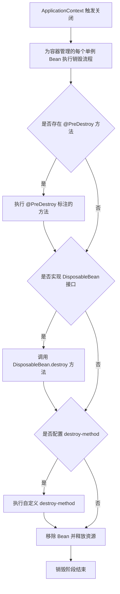
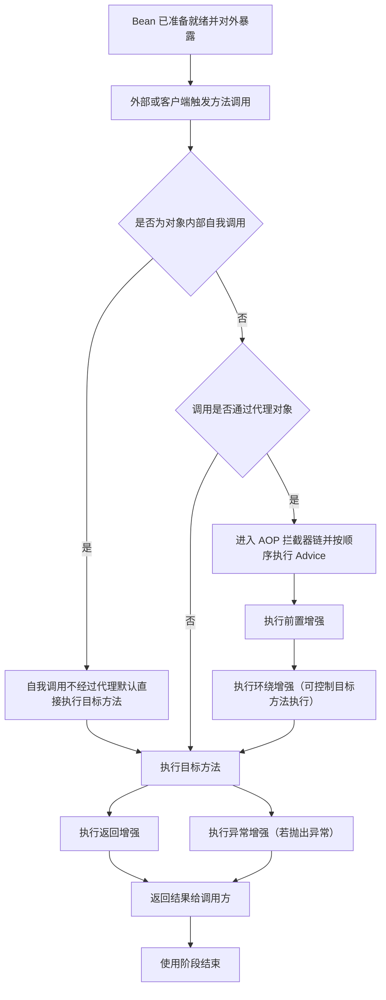

# spring
Spring的一个最大的目的就是使JAVA EE开发更加容易。同时，Spring之所以与Struts、Hibernate等单层框架不同，是因为Spring致力于提供一个以统一的、高效的方式构造整个应用，并且可以将单层框架以最佳的组合揉和在一起建立一个连贯的体系。可以说Spring是一个提供了更完善开发环境的一个框架，可以为POJO(Plain Ordinary Java Object)对象提供企业级的服务。
## Spring的特性和优势
### 特性
- 非侵入式：基于Spring开发的应用中的对象可以不依赖于Spring的API
- 控制反转：IOC——Inversion of Control，指的是将对象的创建权交给 Spring 去创建。使用 Spring 之前，对象的创建都是由我们自己在代码中new创建。而使用 Spring 之后。对象的创建都是给了 Spring 框架。
- 依赖注入：DI——Dependency Injection，是指依赖的对象不需要手动调用 setXX 方法去设置，而是通过配置赋值。
- 面向切面编程：Aspect Oriented Programming——AOP
- 容器：Spring 是一个容器，因为它包含并且管理应用对象的生命周期
- 组件化：Spring 实现了使用简单的组件配置组合成一个复杂的应用。在 Spring 中可以使用XML和Java注解组合这些对象。
- 一站式：在 IOC 和 AOP 的基础上可以整合各种企业应用的开源框架和优秀的第三方类库（实际上 Spring 自身也提供了表现层的 SpringMVC 和持久层的 Spring JDBC）

### 优势
- Spring 可以使开发人员使用 POJOs 开发企业级的应用程序。只使用 POJOs 的好处是你不需要一个 EJB 容器产品，比如一个应用程序服务器，但是你可以选择使用一个健壮的 servlet 容器，比如 Tomcat 或者一些商业产品。
- Spring 在一个单元模式中是有组织的。即使包和类的数量非常大，你只要担心你需要的，而其它的就可以忽略了。
- Spring 不会让你白费力气做重复工作，它真正的利用了一些现有的技术，像 ORM 框架、日志框架、JEE、Quartz 和 JDK 计时器，其他视图技术。
- 测试一个用 Spring 编写的应用程序很容易，因为环境相关的代码被移动到这个框架中。此外，通过使用 JavaBean-style POJOs，它在使用依赖注入注入测试数据时变得更容易。
- Spring 的 web 框架是一个设计良好的 web MVC 框架，它为比如 Structs 或者其他工程上的或者不怎么受欢迎的 web 框架提供了一个很好的供替代的选择。MVC 模式导致应用程序的不同方面(输入逻辑，业务逻辑和UI逻辑)分离，同时提供这些元素之间的松散耦合。模型-(Model)封装了应用程序数据，通常它们将由 POJO 类组成。视图(View)负责渲染模型数据，一般来说它生成客户端浏览器可以解释 HTML 输出。控制器(Controller)负责处理用户请求并构建适当的模型，并将其传递给视图进行渲染。
- Spring 对 JavaEE 开发中非常难用的一些 API（JDBC、JavaMail、远程调用等），都提供了封装，使这些API应用难度大大降低。
- 轻量级的 IOC 容器往往是轻量级的，例如，特别是当与 EJB 容器相比的时候。这有利于在内存和 CPU 资源有限的计算机上开发和部署应用程序。
- Spring 提供了一致的事务管理接口，可向下扩展到（使用一个单一的数据库，例如）本地事务并扩展到全局事务（例如，使用 JTA）
## Core Container（Spring的核心容器）
Spring 的核心容器是其他模块建立的基础，由 Beans 模块、Core 核心模块、Context 上下文模块和 SpEL 表达式语言模块组成，没有这些核心容器，也不可能有 AOP、Web 等上层的功能。具体介绍如下。
- Beans 模块：提供了框架的基础部分，包括控制反转和依赖注入。
- Core 核心模块：封装了 Spring 框架的底层部分，包括资源访问、类型转换及一些常用工具类。
- Context 上下文模块：建立在 Core 和 Beans 模块的基础之上，集成 Beans 模块功能并添加资源绑定、数据验证、国际化、Java EE 支持、容器生命周期、事件传播等。ApplicationContext 接口是上下文模块的焦点。
- SpEL 模块：提供了强大的表达式语言支持，支持访问和修改属性值，方法调用，支持访问及修改数组、容器和索引器，命名变量，支持算数和逻辑运算，支持从 Spring 容器获取 Bean，它也支持列表投影、选择和一般的列表聚合等。

## 核心流程
### 启动

```mermaid
graph TD
  Start["ApplicationContext 启动并刷新"]
  LoadDefinitions["加载并解析 BeanDefinition"]
  InvokeBFPP["执行 BeanFactoryPostProcessor"]
  RegisterBPP["注册并初始化 BeanPostProcessor 列表"]
  ForEachBean["为单个 Bean 开始创建"]
  BeforeInstDecision{"postProcessBeforeInstantiation 是否返回替代实例"}
  UseShortInstance["使用替代实例并跳过默认实例化与属性注入"]
  ShortPostAfter["对替代实例执行 postProcessAfterInitialization"]
  Instantiate["实例化 Bean（构造器或工厂方法）"]
  AfterInstDecision{"postProcessAfterInstantiation 是否返回 false（跳过属性填充）"}
  SkipPopulate["跳过属性填充"]
  ScopeDecision{"是否为单例作用域"}
  ExposeEarlyFactory["向 singletonFactories 注册 ObjectFactory 以支持早期引用"]
  PopulateProperties["填充属性并处理依赖注入"]
  CheckCircular{"填充过程中是否发现循环依赖"}
  GetEarlyRef["从 earlySingletonObjects 或 singletonFactories 获取早期引用并注入"]
  InvokeAware["回调 Aware 接口方法（如 BeanNameAware）"]
  PostProcessBeforeInit["调用 BeanPostProcessor.postProcessBeforeInitialization"]
  PostConstructCheck{"是否存在 @PostConstruct 方法"}
  PostConstructMethods["执行 @PostConstruct 标注的方法"]
  AfterPropertiesSetCheck{"是否实现 InitializingBean"}
  AfterPropertiesSet["调用 InitializingBean.afterPropertiesSet"]
  CustomInitCheck{"是否配置 init-method"}
  CustomInitMethod["执行自定义 init-method"]
  PostProcessAfterInit["调用 BeanPostProcessor.postProcessAfterInitialization"]
  NeedProxy{"是否匹配切点或 Advisor 需要创建代理"}
  CreateProxy["组装拦截器链并创建代理（JDK 动态代理或 CGLIB）"]
  BeanReady["Bean 准备就绪并对外暴露（代理或者原始对象）"]
  EndCreation["创建阶段完成"]

  Start --> LoadDefinitions --> InvokeBFPP --> RegisterBPP --> ForEachBean
  ForEachBean --> BeforeInstDecision
  BeforeInstDecision -- "是" --> UseShortInstance --> ShortPostAfter --> BeanReady
  BeforeInstDecision -- "否" --> Instantiate
  Instantiate --> AfterInstDecision
  AfterInstDecision -- "是" --> SkipPopulate --> InvokeAware
  AfterInstDecision -- "否" --> ScopeDecision
  ScopeDecision -- "是" --> ExposeEarlyFactory --> PopulateProperties
  ScopeDecision -- "否" --> PopulateProperties
  PopulateProperties --> CheckCircular
  CheckCircular -- "是" --> GetEarlyRef --> PopulateProperties
  CheckCircular -- "否" --> InvokeAware
  InvokeAware --> PostProcessBeforeInit --> PostConstructCheck
  PostConstructCheck -- "是" --> PostConstructMethods --> AfterPropertiesSetCheck
  PostConstructCheck -- "否" --> AfterPropertiesSetCheck
  AfterPropertiesSetCheck -- "是" --> AfterPropertiesSet --> CustomInitCheck
  AfterPropertiesSetCheck -- "否" --> CustomInitCheck
  CustomInitCheck -- "是" --> CustomInitMethod --> PostProcessAfterInit
  CustomInitCheck -- "否" --> PostProcessAfterInit
  PostProcessAfterInit --> NeedProxy
  NeedProxy -- "是" --> CreateProxy --> BeanReady
  NeedProxy -- "否" --> BeanReady
  BeanReady --> EndCreation
```

创建阶段方法/节点作用说明（要点）

- ApplicationContext 启动并刷新：启动容器并触发后续解析与处理流程。
- 加载并解析 BeanDefinition：读取配置类或 XML，生成每个 Bean 的元数据。
- BeanFactoryPostProcessor：在 Bean 实例化前修改 Bean 定义或配置属性。
- 注册 BeanPostProcessor：收集所有后置处理器，供后续实例化生命周期调用。
- postProcessBeforeInstantiation：InstantiationAwareBeanPostProcessor 提供的钩子，可在实例化前短路并返回替代实例（常用于提前创建代理）。
- 实例化（构造器或工厂方法）：真正创建对象实例的阶段。
- postProcessAfterInstantiation：可决定是否继续属性填充；返回 false 时跳过填充。
- 单例早期引用与三级缓存（ExposeEarlyFactory / earlySingletonObjects 等）：为解决单例属性注入的循环依赖而暴露早期引用。
- 属性填充：解析 @Autowired、@Value 等注解并注入依赖。
- Aware 回调：若实现 Aware 接口，容器会注入相关环境并回调接口方法。
- postProcessBeforeInitialization：BeanPostProcessor 的前置方法，常用于准备或包装属性。
- @PostConstruct、afterPropertiesSet、init-method：初始化回调链，按此顺序执行框架和自定义初始化逻辑。
- postProcessAfterInitialization：后置处理器的最后一步，自动代理创建器通常在此判断是否为目标创建代理并返回代理对象。
- 代理创建：根据切点组装拦截器链并选择代理实现，代理将替代原始对象对外暴露。

### 销毁

销毁阶段方法/节点作用说明（要点）

- ApplicationContext 关闭：触发容器级别的销毁流程，通常在应用停止或热重启时发生。
- @PreDestroy：在销毁前执行的注解方法，用于释放资源或注销注册。
- DisposableBean.destroy：实现 DisposableBean 接口的销毁回调，由容器调用。
- 自定义 destroy-method：配置于 Bean 定义的自定义销毁方法，容器在销毁阶段调用。
- 移除并释放资源：容器完成回调后回收引用，关闭连接池等资源，完成 Bean 的销毁。

### 调用

使用阶段方法/节点作用说明（要点）

- Bean 已准备就绪：此时容器对外提供的可能是代理对象或原始对象。
- 自我调用（self-invocation）：对象内部直接调用自身方法通常绕过代理而不触发切面，若需要拦截需通过代理对象调用或获取当前代理。
- 代理检查：方法调用到达时判断是否由代理接管；若是代理对象则进入拦截链。
- 拦截器链：按切面定义顺序执行增强逻辑，包括前置、环绕、返回、异常等增强。
- 环绕增强：可在调用前后执行自定义逻辑并决定是否以及何时调用目标方法。
- 返回与异常增强：在目标方法正常返回或抛出异常后分别执行对应增强逻辑。