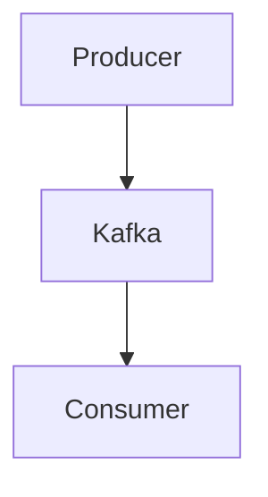

# Java知识网络

https://github.com/dezhishen/java-knowledge

> 知识树来源-> https://pdai.tech/md/java/basic/java-basic-oop.html

自用复习，只用于强化自身学习，**不具备完整知识**。

## 渲染方案（GitBook + MkDocs 并行）

当前仓库保留两套文档渲染方式：

- `GitBook(Honkit)`：仅保留为备份方案，工作流 `.github/workflows/gitbook.yml` 仅手动触发。
- `MkDocs(Material)`：主发布方案，配置文件 `mkdocs.yml`，工作流 `.github/workflows/mkdocs.yml` 在推送到 `main/master` 时自动部署 GitHub Pages（也支持手动触发）。

### 本地预览

GitBook:

```bash
npm install
npm run serve
```

MkDocs:

```bash
python -m venv .venv
source .venv/bin/activate
pip install -r requirements-mkdocs.txt
mkdocs serve
```

### Mermaid 使用

在 Markdown 中使用标准 fenced code：

```markdown

```

MkDocs 已在 `mkdocs.yml` 中配置 Mermaid 渲染脚本，GitBook 继续使用原有 `mermaid-gb3` 插件。
