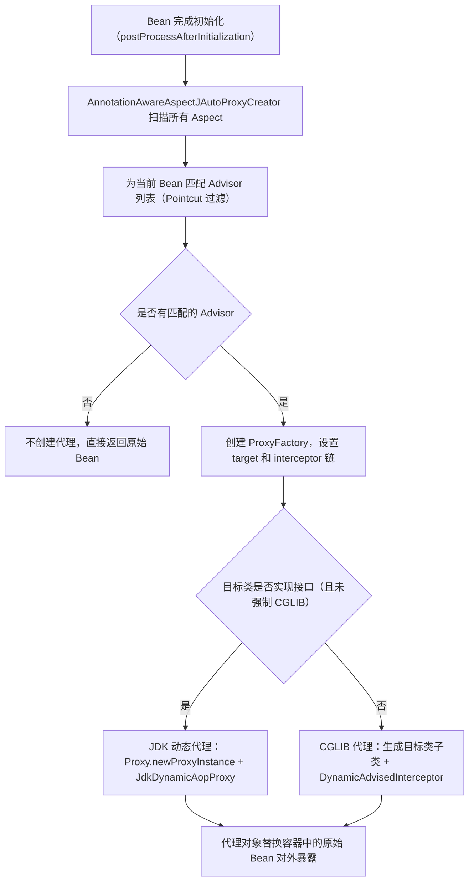
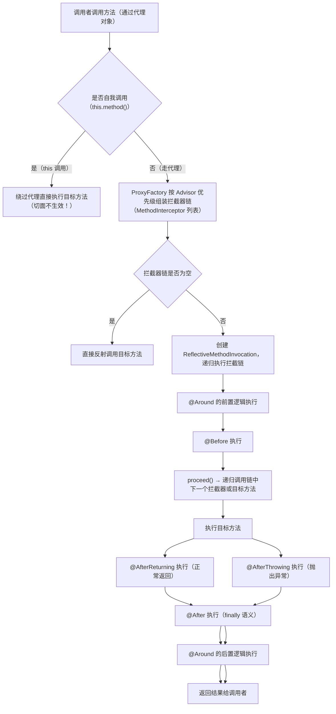

# AOP
面向切面编程：Aspect Oriented Programming——AOP

AOP 是 Spring 的核心特性之一，用来把「与业务无关但到处重复」的横切逻辑（日志、权限、事务、监控等）从业务代码中抽离出来，统一维护。

---

## 核心概念（术语速查）

| 术语（英/中） | 一句话解释 | 类比 |
|---|---|---|
| **Aspect（切面）** | 封装横切逻辑的模块，包含切点 + 增强 | 流水线上的「质检岗位」 |
| **JoinPoint（连接点）** | 程序执行过程中可以被拦截的点（方法调用、异常抛出等） | 流水线上每一个「可插手的地方」 |
| **Pointcut（切点）** | 描述「拦截哪些 JoinPoint」的表达式，是连接点的过滤规则 | 质检员的「工作范围说明书」 |
| **Advice（增强/通知）** | 在切点匹配的连接点上执行的额外逻辑 | 质检员在那个节点实际做的动作 |
| **Target（目标对象）** | 被代理的原始对象 | 流水线上被检查的产品 |
| **Proxy（代理对象）** | 包裹目标对象的代理，方法调用先经过代理再到目标 | 套在产品外面的「质检外壳」 |
| **Weaving（织入）** | 把增强逻辑插入目标代码的过程 | 把质检步骤嵌进流水线 |
| **Advisor（顾问）** | Spring 特有概念，Pointcut + Advice 的组合单元 | 一张「在哪干什么」的任务卡 |

---

## 五种 Advice 类型

| 注解 | 执行时机 | 能拿到返回值/异常 | 能阻止方法执行 |
|---|---|---|---|
| `@Before` | 目标方法执行**前** | 否 | 否（除非抛异常） |
| `@AfterReturning` | 目标方法**正常返回后** | 能拿到返回值 | 否 |
| `@AfterThrowing` | 目标方法**抛出异常后** | 能拿到异常 | 否 |
| `@After` | 方法结束后（无论正常/异常，相当于 finally） | 否 | 否 |
| `@Around` | 完全包裹，手动调用 `proceed()` | 能拿/修改返回值 | 能（不调用 proceed 即可） |

> **执行顺序**（单切面）：`@Around 前` → `@Before` → 目标方法 → `@Around 后` → `@AfterReturning` / `@AfterThrowing` → `@After`

多切面时按 `@Order` 值从小到大（值越小优先级越高）嵌套执行，像洋葱圈。

---

## 两种代理机制

Spring AOP 在运行时生成代理对象，不修改原始字节码（与 AspectJ 编译期/加载期织入不同）。

### JDK 动态代理
- **条件**：目标类**实现了至少一个接口**
- **原理**：`java.lang.reflect.Proxy` 在运行时生成接口的实现类，通过 `InvocationHandler` 拦截方法调用
- **限制**：只能代理接口中定义的方法；`final` 方法无法拦截

### CGLIB 代理
- **条件**：目标类**没有实现接口**（或强制配置使用 CGLIB）
- **原理**：字节码增强库生成目标类的**子类**并覆写方法，在方法中插入增强逻辑
- **限制**：`final` 类和 `final` 方法无法代理；类必须有无参构造（或 CGLIB Objenesis 绕过）

```
Spring Boot 2.x 及以上默认对所有 Bean 使用 CGLIB，
可通过 spring.aop.proxy-target-class=false 改回 JDK 代理。
```

---

## 核心流程

### 代理创建流程



### 方法调用拦截流程



---

## Pointcut 表达式

最常用的是 `execution` 表达式：

```
execution(修饰符? 返回类型 类路径?方法名(参数) 异常?)
```

```java
// 拦截 com.example.service 包下所有类的所有公共方法
@Pointcut("execution(public * com.example.service.*.*(..))")

// 拦截 UserService 的所有方法
@Pointcut("execution(* com.example.service.UserService.*(..))")

// 拦截所有标注了 @Log 注解的方法
@Pointcut("@annotation(com.example.annotation.Log)")

// 拦截目标类上标注了 @Service 的所有方法
@Pointcut("@within(org.springframework.stereotype.Service)")

// within：精确匹配包内的类（不含子包）
@Pointcut("within(com.example.service.*)")

// 组合切点（&&、||、!）
@Pointcut("execution(* com.example.service.*.*(..)) && !execution(* com.example.service.*.get*(..))")
```

常用通配符：
- `*`：匹配任意单词段（一个包名、一个方法名、任意返回类型等）
- `..`：匹配任意多个包段或任意参数列表

---

## 代码示例

### 定义一个完整切面

```java
@Aspect
@Component
public class LogAspect {

    // 切点：service 包下所有公共方法
    @Pointcut("execution(public * com.example.service.*.*(..))")
    public void serviceLayer() {}

    // 前置增强
    @Before("serviceLayer()")
    public void logBefore(JoinPoint joinPoint) {
        System.out.println("调用方法：" + joinPoint.getSignature().getName());
    }

    // 返回增强：可拿到返回值
    @AfterReturning(pointcut = "serviceLayer()", returning = "result")
    public void logAfterReturning(JoinPoint joinPoint, Object result) {
        System.out.println("方法返回：" + result);
    }

    // 异常增强：可拿到异常
    @AfterThrowing(pointcut = "serviceLayer()", throwing = "ex")
    public void logAfterThrowing(JoinPoint joinPoint, Exception ex) {
        System.out.println("方法异常：" + ex.getMessage());
    }

    // 后置增强（finally 语义）
    @After("serviceLayer()")
    public void logAfter(JoinPoint joinPoint) {
        System.out.println("方法结束：" + joinPoint.getSignature().getName());
    }

    // 环绕增强：最强，可修改参数/返回值，可控制是否执行目标方法
    @Around("serviceLayer()")
    public Object logAround(ProceedingJoinPoint pjp) throws Throwable {
        long start = System.currentTimeMillis();
        Object result = pjp.proceed(); // 不调用此行则目标方法不执行
        long cost = System.currentTimeMillis() - start;
        System.out.println("耗时：" + cost + "ms");
        return result;
    }
}
```

### 解决自我调用问题

```java
// ❌ 自我调用：AOP 不生效
@Service
public class OrderService {
    public void createOrder() {
        // this 调用，绕过代理，@Transactional 不会生效！
        this.saveOrder();
    }

    @Transactional
    public void saveOrder() { ... }
}

// ✅ 方案1：注入自身代理
@Service
public class OrderService {
    @Autowired
    private OrderService self; // 注入的是代理对象

    public void createOrder() {
        self.saveOrder(); // 走代理，切面生效
    }

    @Transactional
    public void saveOrder() { ... }
}

// ✅ 方案2：通过 AopContext 获取当前代理（需开启 exposeProxy）
// 配置：@EnableAspectJAutoProxy(exposeProxy = true)
public void createOrder() {
    ((OrderService) AopContext.currentProxy()).saveOrder();
}
```

---

## Spring AOP vs AspectJ

| 对比项 | Spring AOP | AspectJ |
|---|---|---|
| 织入方式 | 运行时动态代理 | 编译期/类加载期字节码织入 |
| 依赖 | 纯 Java，无需特殊编译器 | 需要 ajc 编译器或 LTW 代理 |
| 支持的连接点 | **仅方法调用** | 方法、字段访问、构造器、静态初始化块等 |
| 自我调用 | 不支持（需额外处理） | 支持 |
| 性能 | 稍低（运行时代理开销） | 更高（编译期织入，无运行时代理） |
| 上手难度 | 低（Spring 原生支持） | 高 |
| 适用场景 | 绝大多数业务场景 | 对性能极致要求或需要更多连接点类型 |

> Spring AOP 内部使用了 AspectJ 的**注解语法**（`@Aspect`、`@Pointcut` 等）和**切点表达式解析器**，但**织入机制完全不同**——Spring 仍是运行时动态代理，并非 AspectJ 的字节码织入。

---

## 常见应用场景

| 场景 | 常用 Advice 类型 | 要点 |
|---|---|---|
| **统一日志** | `@Around` | 记录入参、出参、耗时、异常，用 `@annotation` 切点配合自定义注解灵活控制 |
| **声明式事务** | `@Around`（框架内部） | `@Transactional` 本质是 Spring AOP 的一个内置切面；`TransactionInterceptor` 作为拦截器织入 |
| **权限校验** | `@Before` | 在方法执行前检查权限，无权则直接抛异常 |
| **接口限流/防重** | `@Around` | 用注解标记需要限流的方法，切面中做 Redis 计数或分布式锁判断 |
| **缓存** | `@Around` | 先查缓存，命中直接返回，未命中调用 `proceed()` 再写缓存（`@Cacheable` 底层即此） |
| **参数校验** | `@Before` | 对入参做统一校验，失败抛业务异常 |
| **链路追踪** | `@Around` | 在方法调用前后传递 TraceId，配合 MDC 或线程上下文 |

---

## 易混淆点总结

1. **`@After` vs `@AfterReturning`**：`@After` 是 finally 语义，无论正常/异常都执行；`@AfterReturning` 只在正常返回时执行。

2. **切面本身不会被代理**：`@Aspect` 标注的类是切面，Spring 不会为切面类本身再生成 AOP 代理（会跳过）。

3. **`final` 方法和类**：CGLIB 是生成子类，`final` 类无法继承，`final` 方法无法覆写，因此切面对它们无效。

4. **`@Transactional` 失效的根本原因**：`@Transactional` 是 Spring AOP 实现的，所有 AOP 失效的场景（自我调用、`final` 方法、非 Spring 管理的对象）都会导致事务失效。

5. **`@Order` 控制多切面顺序**：数值越小优先级越高，最外层的切面最先进入、最后退出（洋葱模型）。

