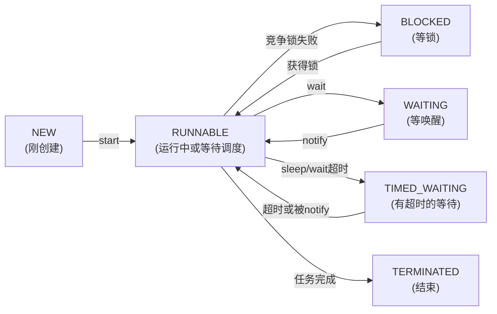

# Java并发面试题问卷

## 第一题：什么是Java并发中的三大问题（可见性、原子性、有序性）？为什么会出现这些问题？

### 30秒快速回答
**三大问题源头：** 计算机为了提高速度，引入了CPU缓存、操作系统时间片轮转、编译器指令优化，这些优化导致了多线程的三大问题：

- **可见性问题**：一个线程改了变量，另一个线程看不到最新值（CPU缓存隔离）
- **原子性问题**：操作被中途打断，只执行了一半（线程切换）  
- **有序性问题**：代码执行顺序被重新排列（指令重排）

### 90秒详细解答

#### 1. 可见性问题（CPU缓存的锅）
```
场景：两个线程，一个修改变量i，另一个读变量i

线程1执行在CPU1上：        线程2执行在CPU2上：
i = 0                      
i = 10  ← 只写到CPU1缓存    j = i  ← 去主存读，读到的还是0！
        不及时写回主存
```
**本质：** 每个CPU有自己的缓存，线程1改的只是CPU1的缓存，线程2看的是主存中的旧值。

#### 2. 原子性问题（线程切换的锅）
```
场景：i = 1，两个线程都执行 i += 1，期望结果是3

i += 1 实际分三步：
CPU指令1：从内存读i到寄存器   i = 1
CPU指令2：在CPU中执行 + 1       i = 2（仅在寄存器中）
CPU指令3：把结果写回内存        主存中 i = 2

时间轴：
线程1执行指令1                 从内存读i=1到寄存器
线程1执行指令2                 寄存器中i=2
  ↓ CPU切换到线程2
线程2执行指令1                 从内存读i=1到寄存器（还是1！）
线程2执行指令2                 寄存器中i=2
线程2执行指令3                 主存i=2
  ↓ CPU切换回线程1
线程1执行指令3                 主存i=2（覆盖了线程2的结果）

最终i=2，而不是期望的3！
```
**本质：** 看起来一个操作的代码，实际分多条CPU指令，线程切换导致指令被打断。

#### 3. 有序性问题（指令重排的锅）
```java
int i = 0;              
boolean flag = false;
i = 1;        // 语句1  
flag = true;  // 语句2

// 你写的代码顺序是先执行语句1，再语句2
// 但编译器/CPU为了优化可能调整顺序：
flag = true;  // 可能被提到前面先执行
i = 1;
```

**为什么会重排？** CPU和编译器发现两句话没有依赖关系，就随意调整顺序来优化性能。

### 深入追问
1. **这三个问题哪个最严重？**
   
   **标准答案：**
   我认为**原子性**最严重，因为它最容易被忽视————看起来是一句代码，其实分多步执行，导致的数据损坏最隐蔽。
   
   有序性其次，可见性最少见（因为现代编程很少手动操作底层变量）。

2. **JVM是怎么解决这些问题的？**
   
   **标准答案：**
   通过**JMM（Java内存模型）**，提供三个工具：
   - `volatile`关键字：解决**可见性和有序性**
   - `synchronized`关键字：解决**可见性、原子性、有序性**（全能，但性能差）
   - `final`关键字：解决**可见性**（对象初始化时的可见性）

### 项目示例
```java
// ❌ 常见bug：多线程访问共享变量而不加保护
class Counter {
    private int count = 0;  // 共享变量
    
    public void increment() {
        count++;  // 这一个++操作分三步，线程不安全！
    }
    
    public int getCount() {
        return count;
    }
}

// 问题：1000个线程各执行1000次increment
// 期望结果：count = 1000000
// 实际结果：因为原子性问题，可能是 999500 之类的随机值

// ✅ 解决方案1：加volatile + 各种原子操作
private AtomicInteger count = new AtomicInteger(0);
public void increment() {
    count.incrementAndGet();  // 原子操作，安全
}

// ✅ 解决方案2：加synchronized
public synchronized void increment() {
    count++;  // 被synchronized保护，只有一个线程能执行
}
```

---

## 第二题：Java线程有哪些状态？Thread.start() 和 Thread.run() 有什么区别？

### 30秒快速回答
**六种线程状态：**
- `NEW`：线程刚创建，还没启动
- `RUNNABLE`：线程正在运行或等待CPU调度
- `BLOCKED`：等待获取锁
- `WAITING`：等待被唤醒（无超时）
- `TIMED_WAITING`：等待超时（有时间限制）
- `TERMINATED`：线程结束

**关键区别：**
- `start()`：启动线程，线程会进入`RUNNABLE`状态，等待CPU调度
- `run()`：直接执行run方法内的代码，**没有启动新线程**，是同步执行

### 90秒详细解答



#### 关键代码对比
```java
class MyTask implements Runnable {
    public void run() {
        System.out.println("执行任务");
    }
}

// ❌ 错误用法：直接调run()
MyTask task = new MyTask();
task.run();  // 不是新线程！在主线程同步执行，打印出来就完事了

// ✅ 正确用法：用start()启动线程
Thread thread = new Thread(task);
thread.start();  // 创建新线程，异步执行
System.out.println("主线程继续");  // 不会阻塞等待task完成
```

### 深入追问
1. **线程进入BLOCKED和WAITING有什么区别？**
   
   **标准答案：**
   - **BLOCKED**：等待获取**锁**（synchronized的对象锁）。获得锁后自动进入RUNNABLE。
   - **WAITING**：主动调用`wait()`进入，需要其他线程调用`notify()`唤醒。
   
   简单说：BLOCKED是被锁阻挡，WAITING是在等待通知。

2. **怎么让线程进入WAITING和TIMED_WAITING状态？**
   
   **标准答案：**
   ```java
   // 进入WAITING
   obj.wait();                    // 需要在synchronized块内
   Thread.currentThread().join(); 
   LockSupport.park();
   
   // 进入TIMED_WAITING
   Thread.sleep(1000);            // 睡1秒
   obj.wait(1000);                // 最多等1秒
   Thread.currentThread().join(1000);
   LockSupport.parkNanos(1000000000);  // 停1秒
   ```

### 项目示例
```java
// 典型场景：生产者-消费者

public class Consumer implements Runnable {
    private Queue<String> queue;
    
    public void run() {
        while (true) {
            synchronized (queue) {  // 获取锁
                while (queue.isEmpty()) {
                    try {
                        queue.wait();  // 队列空，进入WAITING，释放锁等通知
                    } catch (InterruptedException e) {}
                }
                String data = queue.poll();
                System.out.println("消费: " + data);
                queue.notifyAll();  // 唤醒生产者
            }
        }
    }
}

public class Producer implements Runnable {
    private Queue<String> queue;
    
    public void run() {
        while (true) {
            synchronized (queue) {
                queue.offer("商品");
                System.out.println("生产: 商品");
                queue.notifyAll();  // 唤醒消费者
                
                try {
                    Thread.sleep(100);  // TIMED_WAITING 100ms
                } catch (InterruptedException e) {}
            }
        }
    }
}

// 线程状态变化过程：
// 消费者：RUNNABLE -> (获得锁) -> 发现队列空 -> 
//         synchronized块内调wait() -> WAITING（释放了锁！）-> 
//         生产者生产后notifyAll() -> RUNNABLE -> 
//         (重新竞争锁) -> BLOCKED(竞争锁) -> RUNNABLE
```

---

## 第三题：synchronized 和 ReentrantLock 有什么区别？各适用什么场景？

### 30秒快速回答
都是**悲观锁**（假设会有冲突，提前加锁防护），都是**可重入锁**（同一线程能多次获取）。

主要区别：
- `synchronized`：JVM层面的锁，性能好，用法简单，但功能少
- `ReentrantLock`：API层级的锁，功能强（能中断、能超时、能公平），但要手动释放

### 90秒详细解答

| 特性 | synchronized | ReentrantLock |
|------|-------------|---------------|
| 实现位置 | JVM底层 | Java代码，基于AQS |
| 使用方式 | 自动获取/释放 | 手动lock()/unlock() |
| 可中断 | ❌ | ✅ lockInterruptibly() |
| 超时获取 | ❌ | ✅ tryLock(timeout) |
| 公平锁 | ❌ 只有非公平 | ✅ new ReentrantLock(true) |
| 条件变量 | ❌ | ✅ condition.await/signal |
| 性能 | 现代JVM优化后，基本相同 | 同上 |

#### 使用示例
```java
// ① synchronized：简单粗暴
synchronized (this) {
    // 共享代码
}  // 自动释放

// ② ReentrantLock：可控性强
ReentrantLock lock = new ReentrantLock();
lock.lock();
try {
    // 共享代码
} finally {
    lock.unlock();  // 必须手动释放！
}

// ③ ReentrantLock的高级用法
lock.tryLock();           // 立即返回成功或失败
lock.tryLock(1, TimeUnit.SECONDS);  // 等1秒后返回
lock.lockInterruptibly(); // 支持被中断

// ④ 条件变量（synchronized做不了）
Condition condition = lock.newCondition();
lock.lock();
try {
    condition.await();  // 等待条件满足
    condition.signal(); // 唤醒等待的线程
} finally {
    lock.unlock();
}
```

### 深入追问
1. **什么是"可重入"？为什么很重要？**
   
   **标准答案：**
   同一个线程在外层方法获得锁后，再进入内层方法也能自动获得同一把锁，无需重新争抢。
   
   如果不可重入，就会**死锁**：
   ```java
   public synchronized void methodA() {
       methodB();  // 调用methodB，需要获取同一把锁
   }
   
   public synchronized void methodB() {
       // 如果锁不可重入，这里会死锁！
       // 因为线程已经持有锁，再去获取同一把锁会失败
   }
   ```

2. **什么时候该用synchronized，什么时候用ReentrantLock？**
   
   **标准答案：**
   - **用synchronized**：99%的场景，代码简洁不容易出错
   - **用ReentrantLock**：需要超时、中断、公平锁或条件变量等高级特性的时候
   
   一般新手就用synchronized，别过度设计。

### 项目示例
```java
// 真实场景：缓存防击穿（一个热点键被大量并发访问）

// ❌ 单纯用synchronized可以工作，但性能差
public class CacheWithLock {
    private Map<String, String> cache = new HashMap<>();
    
    public String get(String key) {
        synchronized (this) {  // 所有读写都加锁，性能低
            if (cache.containsKey(key)) {
                return cache.get(key);
            }
            // 从DB加载
            String value = loadFromDB(key);
            cache.put(key, value);
            return value;
        }
    }
}

// ✅ 用ReentrantLock的tryLock实现"双重检查"
public class CacheOptimized {
    private Map<String, String> cache = new ConcurrentHashMap<>();
    private ReentrantLock lock = new ReentrantLock();
    
    public String get(String key) {
        // 第一次检查，不加锁（快速路径）
        String value = cache.get(key);
        if (value != null) {
            return value;
        }
        
        // 第二次检查，加锁（慢速路径）
        if (lock.tryLock()) {  // 非阻塞获锁，获不到就返回false
            try {
                // double check
                value = cache.get(key);
                if (value != null) return value;
                
                // 这段代码只有一个线程执行，其他都快速失败
                value = loadFromDB(key);
                cache.put(key, value);
            } finally {
                lock.unlock();
            }
        } else {
            // 获锁失败，这个线程让出去，可以实现限流效果
            System.out.println("缓存热点，拒绝处理");
            return null;
        }
        return value;
    }
}
```
